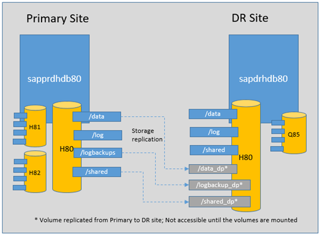

# Microsoft Snapshot Tools for SAP HANA on Azure Large Instance

## Abstract

How to guide for the snapshot tools Microsoft provide to perform snapshots and disaster recovery fail-over of SAP HANA on Azure Large Instances.

## Table of Contents

- [Version](#version)
- [Authors](#authors)
- [Introduction](#introduction)
- [Terms and Definitions](#terms-and-definitions)
- [Overview](#overview)
  - [Getting the snapshot tools](#getting-the-snapshot-tools)
    - [Verifying the download](#verifying-the-download)
- [Supported Scenarios](#supported-scenarios)
- [Snapshot Support Matrix from SAP](#snapshot-support-matrix-from-sap)
- [Important things to remember](#important-things-to-remember)
- [Guidance provided in this document](#guidance-provided-in-this-document)
  - [Snapshots](#taking-snapshot-backups)
  - [Disaster Recovery](#performing-disaster-recovery)
- [Technical Setup](#technical-setup)
  - [Pre-requisites for installation](#pre-requisites-for-installation)
    - [Enable communication with storage](#enable-communication-with-storage)
    - [Enable communication with SAP HANA](#enable-communication-with-sap-hana)
  - [Installing the snapshot tools](#installing-the-snapshot-tools)
    - [Easy installation of snapshot tools (default)](#easy-installation-of-snapshot-tools-default)
    - [Uninstallation of the snapshot tools](#uninstallation-of-the-snapshot-tools)
    - [Manual installation of the snapshot tools](#manual-installation-of-the-snapshot-tools)
    - [Complete setup of snapshot tools](#complete-setup-of-snapshot-tools)
    - [Configuration file for snapshot tools](#configuration-file-for-snapshot-tools)
  - [Upgrading the snapshot tools](#upgrading-the-snapshot-tools)
    - [Gather Existing Installation details](#gather-existing-installation-details)
    - [From version 4.0](#from-version-40)
    - [From versions <= 3.4.1](#from-versions-prior-to-and-including-v341)
- [SAP HANA Configuration](#sap-hana-configuration)
  - [Configure log backup location](#configure-log-backup-location)
  - [Configure catalog backup location](#configure-catalog-backup-location)
  - [Check log and catalog backup locations](#check-log-and-catalog-backup-locations)
  - [Configure log backup timeout](#configure-log-backup-timeout)
  - [Warning about diskspace](#warning-about-diskspace)
- [Snapshot Tools Execution and Details](#snapshot-tools-execution-and-details)
  - [Config file - HANABackupCustomerDetails.txt](#config-file---hanabackupcustomerdetailstxt)
  - [Check connectivity with SAP HANA --testHANAConnection](#check-connectivity-with-sap-hana---testhanaconnection)
  - [Check connectivity with storage - testStorageSnapshotConnection](#check-connectivity-with-storage---teststoragesnapshotconnection)
  - [Perform snapshot backup - azure_hana_backup](#perform-snapshot-backup---azure_hana_backup)
  - [Remove test snapshots - removeTestStorageSnapshot](#remove-test-snapshots---removeteststoragesnapshot)
  - [List snapshots - azure_hana_snapshot_details](#list-snapshots---azure_hana_snapshot_details)
  - [Delete a snapshot - azure_hana_snapshot_delete](#delete-a-snapshot---azure_hana_snapshot_delete)
  - [Get DR replication status - azure_hana_replication_status](#get-dr-replication-status---azure_hana_replication_status)
  - [Perform a test DR failover - azure_hana_test_dr_failover](#perform-a-test-dr-failover---azure_hana_test_dr_failover)
  - [Perform full DR failover - azure_hana_dr_failover](#perform-full-dr-failover---azure_hana_dr_failover)
- [Guidance for using these tools](#guidance-for-using-these-tools)
  - [How to take snapshots manually](#how-to-take-snapshots-manually)
  - [How to setup automatic snapshot backup](#how-to-setup-automatic-snapshot-backup)
  - [How to monitor the snapshots](#how-to-monitor-the-snapshots)
  - [How to delete a snapshot?](#how-to-delete-a-snapshot)
  - [How to restore a 'hana' snapshot](#how-to-restore-a-hana-snapshot)
  - [How to setup 'boot' snapshot only](#how-to-setup-snapshots-for-boot-only)
  - [How to restore a 'boot' snapshot](#how-to-restore-a-boot-snapshot)
  - [What are key facts to know about the snapshots](#what-are-key-facts-to-know-about-the-snapshots)
- [Disaster Recovery](#disaster-recovery)
  - [1. What are the prerequisites for DR setup](#1-what-are-the-prerequisites-for-dr-setup)
  - [2. How to setup a disaster recovery?](#2-how-to-setup-a-disaster-recovery)
  - [3. How to monitor the data replication from Primary to DR site?](#3-how-to-monitor-the-data-replication-from-primary-to-dr-site)
  - [4. How to perform a failover to DR site?](#4-how-to-perform-a-failover-to-dr-site)
- [Troubleshooting](#troubleshooting)
- [Appendix - Changelog](#appendix---changelog)
  - [Changes in v4.3](#changes-in-v43)
  - [Changes in v4.2](#changes-in-v42)
  - [Changes in v4.1](#changes-in-v41)
  - [Changes in v4.0](#changes-in-v40)
  - [Changes in v3.4.1](#changes-in-v341)
  - [Changes in v3.4](#changes-in-v34)
  - [Changes between release v3.3 and v3.4](#changes-between-release-v33-and-v34)

## Version

This document is for the SAP HANA on Azure Large Instance snapshot tools **version 4.3**.

## Authors

Phil Jensen

## Contributors

Juergen Thomas, Sachin Ghorpade, Amish Patel, Serge Muts, Vamsi Sangam.

<p style="display: none;">\newpage</p>

## Introduction

This document provides details on the snapshot tools used for the SAP HANA on Azure Large Instances.
These snapshot tools are tested and supported by Microsoft and serve the following purposes:

1. Create storage snapshots of SAP HANA.
1. Check status, backup and removal of storage snapshots.
1. Self Service Disaster Recovery failover when the DR scenario has been deployed.

This document is intended to provide "How To" details about these snapshot tools which are
developed and supported by Microsoft for the specific purpose of performing database consistent
storage snapshots on SAP HANA on Azure Large Instances.

Disclaimer: _This guide is written based on successful testing in Microsoft's lab containing SAP HANA on Azure Large Instances. Customers are responsible for monitoring and
testing to ensure the snapshot tools are performing as expected._

## Terms and Definitions

Glossary of terms and definitions used in this documentation:

- **SID** : A system identifier for HANA system.
- **Multipurpose DR** : A disaster recovery system which has more than one instances configured.
    One of the instances is intended to provide DR for the production SID, other instances are
    non-production HANA instances.
- **Normal DR** : A disaster recovery system which just has a primary SID configured with storage
    replication running. There is no other workload running on a "Normal DR" while production
    instance is up and running at primary site.
- **Single SID system** : A system which has only one HANA instance configured.
- **Multi SID system** : A system which has more than one HANA instances configured. Also known
    in SAP documentation as MCOS deployment.
- **HLI** : SAP HANA on Azure Large Instances Unit.
- **DR** : Disaster Recovery.
- **HSR** : HANA System Replication.

## Overview

The (new from v4.0) self-installer provides a single file bundle for customers to install and configure the
storage snapshot tools for SAP HANA on Azure Large Instance.

The snapshot tools included in the installation file are described as follows:

- **azure_hana_backup:** The primary tool to execute database consistent storage snapshots for
    the SAP HANA data & shared, logbackups, or boot volumes.
  - With the SSL option this command requires two files per SID, each with the PEM extension (text-based certificate file as defined in RFC 1421 through RFC 1424).
- **azure_hana_replication_status:** Provides basic details around the replication status from the
    production site to the disaster-recovery site. The snapshot command monitors to ensure that
    the replication is taking place, and it shows the size of the items that are being replicated. It
    also provides guidance if a replication is taking too long or if the link is down.
- **azure_hana_snapshot_details:** Provides a list of basic details about the snapshots, per
    volume, that exist in your environment. This command can be run on the primary server or on
    a server in the disaster-recovery location. The command provides the following information
    broken down by each volume that contains snapshots:
  - Size of total snapshots in a volume.
  - Each snapshot in that volume includes the following details:
    - Snapshot name
    - Create time
    - Size of the snapshot
    - Frequency of the snapshot
    - HANA Backup ID associated with that snapshot, if relevant
- **azure_hana_snapshot_delete:** This command deletes a storage snapshot or a set of
    snapshots. You can use either the SAP HANA Backup ID as found in HANA Studio or the storage
    snapshot name. The Backup ID is only tied to the 'hana' snapshots which are created for the
    data & shared volumes. Otherwise, if the snapshot name is entered, it searches for all
    snapshots that match the entered snapshot name.
- **HANABackupCustomerDetails.txt:** This file is a modifiable configuration file that you need to
    modify to adapt to your SAP HANA configuration.
- **testHANAConnection:** This command tests the connection to the SAP HANA instance and is
    required to validate set up of the snapshot tools.
  - With the SSL option this command requires two files per SID, each with the PEM
    extension (text-based certificate file as defined in RFC 1421 through RFC 1424).
- **testStorageSnapshotConnection:** This snapshot command has two main steps. First, it
    ensures that the SAP HANA on Azure Large Instance system that runs the snapshot tools can
    communicate with the underlying storage interface. Second, it creates a temporary storage
    snapshot for the SAP HANA on Azure Large Instance being tested. This command should be
    run for every HANA instance on a server to ensure the snapshot tools can communicate with
    the storage so they function as expected.
- **removeTestStorageSnapshot:** This snapshot command deletes the test snapshot as created
    with the snapshot command _testStorageSnapshotConnection_.
- **azure_hana_dr_failover:** This command forces a DR Failover into another paired region. This
    snapshot command **stops** storage replication from the primary site to the secondary site, and
    presents the latest available snapshot on the DR volumes along with recommended filesystem
    mountpoints for the DR volumes. This command must be run on the HANA Large Instance
    system **in the DR region** (i.e. the target fail-over system).
- **azure_hana_test_dr_failover:** This command performs a test failover to the paired DR site.
    Unlike the azure_hana_dr_failover command, this execution does not interrupt the storage
    replication from primary to secondary. Instead clones of the latest available snapshot are
    created at the DR site and recommended filesystem mountpoints of the cloned volumes are
    presented. This command must be run on the HANA Large Instance system **in the DR region**
    (i.e. the target fail-over system).

### Getting the snapshot tools

It is recommended customers get the most recent version of the self-installation file (e.g.
azure_hana_snapshot_installer_v4.0.run or later) which contains the snapshot tools from GitHub
(<https://github.com/Azure/hana-large-instances-self-service-scripts>). Then follow the steps in the
Technical Setup section of this guide to install.

The self-installation file is signed with Microsoft's public key to allow for GPG verification of the
download.

#### Verifying the download

The installer, which is downloadable per above, has an associated PGP signature file with a .asc
filename extension. This file can be used to verify the downloaded installer to ensure this is a
Microsoft provided file. The Microsoft PGP Public Key used for signing Linux packages is available here
(<http://packages.microsoft.com/keys/microsoft.asc>) and has been used to sign the signature file.

The Microsoft PGP Public Key can be imported to a user's local as follows:

```bash
> wget http://packages.microsoft.com/keys/microsoft.asc
> gpg --import microsoft.asc
```

The following commands trust the Microsoft PGP Public Key:

1. List the keys in the store.
2. Edit the Microsoft key.
3. Check the fingerprint with fpr
4. Sign the key to trust it.

```bash
> gpg --list-keys
----<snip>----
pub rsa2048 2015- 10 - 28 [SC]
BC528686B50D79E339D3721CEB3E94ADBE1229CF
uid [ unknown] Microsoft (Release signing) gpgsecurity@microsoft.com

> gpg --edit-key gpgsecurity@microsoft.com
gpg (GnuPG) 2.1.18; Copyright (C) 2017 Free Software Foundation, Inc.
This is free software: you are free to change and redistribute it.
There is NO WARRANTY, to the extent permitted by law.
pub rsa2048/EB3E94ADBE1229CF
created: 2015- 10 - 28 expires: never usage: SC
trust: unknown validity: unknown
[ unknown] (1). Microsoft (Release signing) <gpgsecurity@microsoft.com>

gpg> fpr
pub rsa2048/EB3E94ADBE1229CF 2015- 10 - 28 Microsoft (Release signing)
<gpgsecurity@microsoft.com>
Primary key fingerprint: BC52 8686 B50D 79E3 39D3 721C EB3E 94AD BE12 29CF

gpg> sign
pub rsa2048/EB3E94ADBE1229CF
created: 2015- 10 - 28 expires: never usage: SC
trust: unknown validity: unknown
Primary key fingerprint: BC52 8686 B50D 79E3 39D3 721C EB3E 94AD BE12 29CF
Microsoft (Release signing) <gpgsecurity@microsoft.com>
Are you sure that you want to sign this key with your
key "XXX XXXX <xxxxxxx@xxxxxxxx.xxx>" (A1A1A1A1A1A1)
Really sign? (y/N) y

gpg> quit
Save changes? (y/N) y
```

The PGP signature file for the installer can be checked as follows:

```bash
> gpg --verify azure_hana_snapshot_installer_v4.0.run.asc
azure_hana_snapshot_installer_v4.0.run
gpg: Signature made Sat 13 Apr 2019 07:51:46 AM STD
gpg: using RSA key EB3E94ADBE1229CF
gpg: Good signature from "Microsoft (Release signing)
<gpgsecurity@microsoft.com>" [full]
```

More details on using GPG can be found in the online manual:

- <https://www.gnupg.org/gph/en/manual/book1.html>

<p style="display: none;">\newpage</p>

## Supported Scenarios

The snapshot tools can be used in the following scenarios.

- Single SID
- Multiple SID
- HSR
- Scale-out
- MDC (Only single tenant supported)
- Single Container
- SUSE Operating System
- RHEL Operating System
- SKU TYPE I
- SKU TYPE II

ref: <https://docs.microsoft.com/en-us/azure/virtual-machines/workloads/sap/hana-supported-scenario>

## Snapshot Support Matrix from SAP

The following matrix is provided as a guideline on which versions of SAP HANA
are supported by SAP for Storage Snapshot Backups.

|                         |1.0 SPS12|2.0 SPS0|2.0 SPS1|2.0 SPS2|2.0 SPS3|2.0 SPS4|
|-------------------------|---------|--------|--------|--------|--------|--------|
|Single Container Database| √       | √      | -      | -      | -      | -      |
|MDC Single Tenant        | -       | -      | √      | √      | √      | √      |
|MDC Multiple Tenants     | -       | -      | -      | -      | -      | √      |
> √ = <small>supported by SAP for Storage Snapshots</small>

## Important things to remember

- SAP does not support snapshot on the MDC environment for the following releases. Though
    snapshot is supported with non-MDC setup for the following releases. The snapshot command
    does not work if you have following HANA releases with MDC setup.
  - HANA 2 SP
  - HANA 1 SP 12
  - HANA 1 SP
  - HANA 1 SP
- For HANA 2 SPS04 and later releases: for MDC environment with more than one tenant, a
    database consistent storage snapshot is supported by SAP and works with these snapshot
    tools.
- For HANA 2 SP1 and releases prior to SPS04: for MDC environment with more than one tenant,
    a database consistent storage snapshot is not supported by SAP. For single tenant it is
    supported by SAP and works with these snapshot tools.
- After setup of the snapshot tools, continuously monitor the storage space available and if
    required, delete the old snapshots on a regular basis to avoid storage fill out.
- Always use the latest snapshot tools. You can download the latest version from GitHub.
- Use the same version of the snapshot tools across the landscape.
- Test the snapshot tools and get comfortable with the parameters required and output of the
    snapshot command before using in the production system.
- Don't change the mount point name of the server provisioned by the Microsoft Operations.
    These snapshot tools rely on these standard mount point names to be available for a
    successful execution.
- When setting up the HANA user for backup (details below in this document), you need to
    setup the user for each HANA instance. Create an SAP HANA user account to access HANA
    instance under the SYSTEMDB (and not in the SID database) for MDC. In the single container
    environment, it can be setup under the tenant database.
- Customers must provide the SSH public key for storage access. This must be done once per
    node and for each user under which the snapshot command is executed.
- The number of snapshots per volume is limited to 250.
- If asked to modify the configuration file, always use the Linux text editor such as "vi" and not
    the Windows editors like notepad. Using Windows editor may corrupt the file format.
- The snapshot tools can now (v4.0+) run as a non-root user. Previously, they were only
    supported to run under root or sidadm user. The installer will setup and configure this
    automatically if the following pre-requisites are met as the root user.
  - Setup hdbuserstore for the SAP HANA user to communicate with SAP HANA.
  - Setup SSH private/public key pairs for the user to communicate with the storage sub-
    system.
- For DR: The snapshot tools must be tested on DR node before DR is setup.
- Monitor disk space regularly, automated log deletion is managed with the `--trim` option of the
    `azure_hana_backup tool` for SAP HANA 2 and later releases.

<p style="display: none;">\newpage</p>

## Guidance provided in this document

The following guidance is provided in this document to illustrate the usage of the snapshot tools.

### Taking Snapshot Backups

- [What are the prerequisites for the storage snapshot](#pre-requisites-for-installation)
  - [Enable communication with storage](#enable-communication-with-storage)
  - [Enable communication with SAP HANA](#enable-communication-with-sap-hana)
- [How to take snapshots manually](1-How-to-take-snapshots-manually)
- [How to setup automatic snapshot backup](2-How-to-setup-automatic-snapshot-backup)
- [How to monitor the snapshots](#3-how-to-monitor-the-snapshots)
- [How to delete a snapshot?](#4-how-to-delete-a-snapshot)
- [How to restore a 'hana' snapshot](#5-how-to-restore-a-hana-snapshot)
- [How to restore a 'boot' snapshot](#6-how-to-restore-a-boot-snapshot)
- [What are key facts to know about the snapshots](#7-what-are-key-facts-to-know-about-the-snapshots)

> Snapshots are tested for both single SID and multi SID.

### Performing Disaster Recovery

- [What are the prerequisites for DR setup](#1-what-are-the-prerequisites-for-dr-setup)
- [How to setup a disaster recovery](#2-how-to-setup-a-disaster-recovery)
- [How to monitor the data replication from Primary to DR site](#3-how-to-monitor-the-data-replication-from-primary-to-dr-site)
- [How to perform a failover to DR site?](#4-how-to-perform-a-failover-to-dr-site)

> DR is tested for single SID failover on a multipurpose DR setup.

## Technical Setup

To test and document these snapshot tools, the following set up was used. All the screen shots and
information presented correspond to **version 4.0+** of the snapshot tools.

- Operating System: SLES 12 SP2+ for SAP
- HANA Large Instances: 2xS192 (four sockets, 2 TB); One for Primary site and second for DR
    site
  - Primary site HLI unit (sapprdhdb80) has 3 SIDs configured: H80, H81, and H82
  - DR site HLI unit (sapdrhdb80) has 2 SIDs configured: Q85, and H80 (replication from
    the Primary site)
- HANA Version: HANA 2.0 SP1+
- Server Names: sapprdhdb80 (Primary) and sapdrhdb80 (DR node).
  - Note `prd` and `dr` in their hostnames.



<font color="red">**CAUTION**</font>
> <font color="red">You may have different screens for operating system or HANA depending on the
version you are using. Also, based on your HANA version, the snapshot tools parameter
may differ. Refer the snapshot command details before using them.
</font>

### Pre-requisites for installation

Please follow the guidelines to setup and execute the snapshots and disaster recovery commands. It
is recommended the following steps are completed as root before installing and using the snapshot
tools.

1. **OS is patched** : Please refer for patching and SMT setup <https://docs.microsoft.com/en-us/azure/virtual-machines/workloads/sap/hana-installation#setting-up-smt-server-for-suse-linux>
1. **Time Synchronization is setup**. The customer will need to provide a NTP compatible time
    server, and configure the OS accordingly.
1. **HANA is installed** : Please refer for HANA installation instructions:
    <https://blogs.msdn.microsoft.com/saponsqlserver/2017/11/21/sap-netweaver-installation->
    on-hana-database/.
   1. In this document, we installed HANA 2.0 SP1 with multi SID as following:
      1. **Primary site HLI unit** (sapprdhdb80) has three HANA instances configured
         with the SIDs: H80, H81, and H82. To install three instances, you need to run
         the hana installer (hdblcmgui) three times with "new instance" option, and
         then provide SID information each time for each instance. So, in this example,
         you run hdblcmgui, three times with H80, H81, and H82 SIDs.
      1. **DR site HLI unit** (sapdrhdb80) has two HANA instances configured: Q85, and
         H80. To install two instances, you need to run the hana installer (hdblcmgui)
         two times with "new instance" option, and then provide SID information each
         time for each instance. So, in this example, you run hdblcmgui, 2 times with
         H80 and Q85 SIDs.
1. **[Enable communication with storage](#enable-communication-with-storage)** (refer separate section for more details) : Customer must
    setup SSH with a private/public key pair, and provide the public key for each node where the
    snapshot tools are planned to be executed to Microsoft Operations for setup on the storage
    back-end.
   1. Test this by running the command `ssh -l <Storage User Name eg: clt1h80backup> <Storage IP Address>` from one of the nodes to ensure the connectivity of the node to
      the storage. Type "exit" to logout of the storage prompt.
   1. Microsoft operations will provide the storage user and storage IP at the time of
      provisioning. Refer section HANABackupCustomerDetails.txt for more details.
1. **[Enable communication with SAP HANA](#enable-communication-with-sap-hana)** (refer separate section for more details) : Customer must
    setup an appropriate SAP HANA user with the required privileges to perform the snapshot.
   1. This can be tested from the command line as follows using the text in `grey`
      1. HANAv1 `hdbsql -n <HANA IP address> -i <HANA instance> -U <HANA user> "\s"`
      1. HANAv2 `hdbsql -n <HANA IP address> -i <HANA instance> -d SYSTEMDB -U <HANA user> "\s"`
      - The examples above are for non-SSL communication to SAP HANA.

#### Enable communication with storage

Communication with the storage back-end executes over an encrypted SSH channel. The following
example steps are to provide guidance on setup of SSH for this communication.

1. Modify the `/etc/ssh/ssh_config` file

Refer to the following output where the `MACs hmac-sha1` line has been added:

```bash
# RhostsRSAAuthentication no
# RSAAuthentication yes
# PasswordAuthentication yes
# HostbasedAuthentication no
# GSSAPIAuthentication no
# GSSAPIDelegateCredentials no
# GSSAPIKeyExchange no
# GSSAPITrustDNS no
# BatchMode no
# CheckHostIP yes
# AddressFamily any
# ConnectTimeout 0
# StrictHostKeyChecking ask
# IdentityFile ~/.ssh/identity
# IdentityFile ~/.ssh/id_rsa
# IdentityFile ~/.ssh/id_dsa
# Port 22
Protocol 2
# Cipher 3des
# Ciphers aes128-ctr,aes192-ctr,aes256-ctr,arcfour256,arcfour128,aes128-cbc,3des-
cbc
# MACs hmac-md5,hmac-sha1,umac-64@openssh.com,hmac-ripemd
MACs hmac-sha
# EscapeChar ~
# Tunnel no
# TunnelDevice any:any
# PermitLocalCommand no
# VisualHostKey no
# ProxyCommand ssh -q -W %h:%p gateway.example.com
```

1. Create a private/public key pair

Using the following example command to generate the key pair, do not enter a password when generating a key.

```bash
> ssh-keygen -t rsa –b 5120 -C ""
```

1. Send the public key to Microsoft Operations

Send the output of the `cat /root/.ssh/id_rsa.pub` command (example below) to Microsoft Operations
to enable the snapshot tools to communicate with the storage sub-system.

```bash
> cat /root/.ssh/id_rsa.pub
ssh-rsa
AAAAB3NzaC1yc2EAAAADAQABAAABAQDoaRCgwn1Ll31NyDZy0UsOCKcc9nu2qdAPHdCzleiTWISvPW
FzIFxz8iOaxpeTshH7GRonGs9HNtRkkz6mpK7pCGNJdxS4wJC9MZdXNt+JhuT23NajrTEnt1jXiVFH
bh3jD7LjJGMb4GNvqeiBExyBDA2pXdlednOaE4dtiZ1N03Bc/J4TNuNhhQbdsIWZsqKt9OPUuTfD
j0XvwUTLQbR4peGNfN1/cefcLxDlAgI+TmKdfgnLXIsSfbacXoTbqyBRwCi7p+bJnJD07zSc9YCZJa
wKGAIilSg7s6Bq/2lAPDN1TqwIF8wQhAg2C7yeZHyE/ckaw/eQYuJtN+RNBD
```

#### Enable communication with SAP HANA

The snapshot tools communicate with SAP HANA and need a user with appropriate permissions to
initiate and release the database save-point. The following provides an example on setup of the SAP
HANA v2 user and the hdbuserstore for communication to the SAP HANA database.

The following example commands setup a user (SHOASNAP) in the SYSTEMDB on SAP HANA 2.
database, change the IP address, usernames and passwords as appropriate:

1. Connect to the SYSTEMDB to create the user

    ```bash
    > hdbsql -n <IP_address_of_host>:30013 -i 00 -u SYSTEM -p <SYSTEM_USER_PASSWORD>

    Welcome to the SAP HANA Database interactive terminal.

    Type: \h for help with commands
    \q to quit

    hdbsql SYSTEMDB=>
    ```

1. Create the user

    This example creates the SHOASNAP user in the SYSTEMDB.

    ```bash
    hdbsql SYSTEMDB=> CREATE USER SHOASNAP PASSWORD <SHOASNAP_PASSWORD_CHANGE_ME> NO FORCE_FIRST_PASSWORD_CHANGE;
    ```

1. Grant the user permissions

    This example sets the permission for the SHOASNAP user to allow for performing a database
    consistent storage snapshot.

    ```bash
    hdbsql SYSTEMDB=> GRANT BACKUP ADMIN, CATALOG READ, MONITORING TO SHOASNAP;
    ```

1. *OPTIONAL* - Prevent user's password from expiring

   <font color="red">**CAUTION**</font>
   > <font color="red">Recommend checking with corporate policy before making this change.
   </font>

   This example disables the password expiration for the SHOASNAP user, without this change the user's password will expire preventing snapshots to be taken correctly.  

   ```bash
   hdbsql SYSTEMDB=> ALTER USER SHOASNAP DISABLE PASSWORD LIFETIME;
   ```

1. Setup the SAP HANA Secure User Store (change the password)
    This example uses the hdbuserstore command from the Linux shell to setup the SAP HANA Secure User store.

    ```bash
    > hdbuserstore Set SHOASNAP <IP_address_of_host>:30013 SHOASNAP <SHOASNAP_PASSWORD_CHANGE_ME>
    ```

1. Check the SAP HANA Secure User Store
    To check if the secure user store is setup correctly, use the hdbuserstore command to list the
    output which should be similar to the following. More details on using hdbuserstore are available
    on the SAP website.

    ```bash
    > hdbuserstore List
    DATA FILE : /home/shoasnap/.hdb/sapprdhdb80/SSFS_HDB.DAT
    KEY FILE : /home/shoasnap/.hdb/sapprdhdb80/SSFS_HDB.KEY


    KEY SHOASNAP
    ENV : <IP_address_of_host>:
    USER: SHOASNAP
    ```

##### Additional instructions for using the log trimmer (SAP HANA 2.0 and later)

If using the log trimmer, then the following example commands setup a user (SHOASNAP) in the
TENANT database(s) on a SAP HANA 2.0 database system. Remember to change the IP address,
usernames and passwords as appropriate:

1. Connect to the TENANT database to create the user, tenant specific details are `<IP_address_of_host>` and `<SYSTEM_USER_PASSWORD>`.  Also, note the port (`30015`) required to communicate with the TENANT database.

    ```bash
    > hdbsql -n <IP_address_of_host>:30015 - i 00 -u SYSTEM -p <SYSTEM_USER_PASSWORD>
  
    Welcome to the SAP HANA Database interactive terminal.

    Type: \h for help with commands
    \q to quit

    hdbsql TENANTDB=>
    ```

1. Create the user

    This example creates the SHOASNAP user in the SYSTEMDB.

    ```bash
    hdbsql TENANTDB=> CREATE USER SHOASNAP PASSWORD <SHOASNAP_PASSWORD_CHANGE_ME> NO FORCE_FIRST_PASSWORD_CHANGE;
    ```

1. Grant the user permissions

    This example sets the permission for the SHOASNAP user to allow for performing a database
    consistent storage snapshot.

    ```bash
    hdbsql TENANTDB=> GRANT BACKUP ADMIN, CATALOG READ, MONITORING TO SHOASNAP;
    ```

1. *OPTIONAL* - Prevent user's password from expiring

   <font color="red">**CAUTION**</font>
   > <font color="red">Recommend checking with corporate policy before making this change.
   </font>

   This example disables the password expiration for the SHOASNAP user, without this change the user's password will expire preventing snapshots to be taken correctly.  

   ```bash
   hdbsql TENANTDB=> ALTER USER SHOASNAP DISABLE PASSWORD LIFETIME;
   ```

> **Note**  repeat these steps for all the tenant databases. It's possible to get the connection details for all the
tenants using the following SQL query against the SYSTEMDB.

```bash
SELECT HOST, SQL_PORT, DATABASE_NAME FROM SYS_DATABASES.M_SERVICES WHERE SQL_PORT LIKE '3%'
```

See the following example query and output.

```bash
> hdbsql -jaxC -n 10.90.0.31:30013 -i 00 -u SYSTEM -p <SYSTEM_USER_PASSWORD> " SELECT HOST, SQL_PORT, DATABASE_NAME FROM SYS_DATABASES.M_SERVICES WHERE SQL_PORT LIKE '3%' "
sapprdhdb80,30013,SYSTEMDB
sapprdhdb80,30015,H81
sapprdhdb80,30041,H82
```

### Installing the snapshot tools

The downloadable self-installer is designed to make the snapshot tools easy to setup and run with
non-root user privileges (e.g. shoasnap). The installer will setup the user and put the snapshot tools
into the users `$HOME/bin` subdirectory (default = `/home/shoasnap/bin`).

The self-installer tries to determine the correct settings and paths for all the files based on the
configuration of the user performing the installation (e.g. root). If the previous setup steps (Enable
communication with storage and SAP HANA) were run as root, then the installation will copy the
private key and the hdbuserstore to the backup user's location. However, it is possible for the steps
which enable communication with the storage back-end and SAP HANA to be manually done by a
knowledgeable administrator after the installation.

> **Note**  For earlier SAP HANA on Azure Large Instance installations, the directory of pre-installed
snapshot tools was `/hana/shared/<SID>/exe/linuxx86_64/hdb`.

With the pre-requisite steps completed, it's now possible to install the snapshot tools using the self-
installer as follows:

1. Copy the downloaded self-installer to the target system.
1. Execute the self-installer as the root user, see the following example. If necessary, make the
    file executable using the `chmod +x *.run` command.

Running the self-installer command without any arguments will display help on using the installer to
install the snapshot tools as follows:

```bash
> chmod +x azure_hana_snapshot_installer_v4.0.run
> ./azure_hana_snapshot_installer_v4.0.run
Usage: ./azure_hana_snapshot_installer_v4.0.run [-v] -I [-u <HLI Snapshot Command user>]
./azure_hana_snapshot_installer_v4.0.run [-v] -X [-d <directory>]
./azure_hana_snapshot_installer_v4.0.run [-h]

Switches enclosed in [] are optional for each command line.
- h prints out this usage.
- v turns on verbose output.
- I starts the installation.
- u is the Linux user to install the scripts into, by default this is
'shoasnap'.
- X will only extract the snapshot commands.
- d is the target directory to extract into, by default this is
'./snapshot_cmds'.
Examples of a target directory are ./tmp or /usr/local/bin
```

> **Note**  The self-installer has an option to extract (-X) the snapshot tools from the bundle without
performing any user creation and setup. This allows an experienced administrator to
complete the setup steps manually, or to copy the commands to upgrade an existing
installation.

#### Easy installation of snapshot tools (default)

The installer has been designed to quickly install the snapshot tools for SAP HANA on Azure. The
manual steps are within each step.

By default, if the installer is run with only the -I option, it will do the following:

1. Create Snapshot user 'shoasnap', home directory, and set group membership.
1. Configure the shoasnap user's login `~/.profile`.
1. Search filesystem for directories to add to shoasnap's `$PATH`, these are typically the paths to
    the SAP HANA tools, such as `hdbsql` and `hdbuserstore`.
1. Search filesystem for directories to add to shoasnap's `$LD_LIBRARY_PATH`. Many commands
    require a library path to be set in order to execute correctly, this configures it for the
    installed user.
1. Copy the SSH keys for back-end storage for shoasnap from the "root" user (the user running
    the install). This assumes the "root" user has already configured connectivity to the storage
    - see section "[Enable communication with storage](#enable-communication-with-storage)".
1. Copy the SAP HANA connection secure user store for the target user, shoasnap. This
    assumes the "root" user has already configured the secure user store – see section "Enable
    communication with SAP HANA".
1. The snapshot tools are extracted into `/home/shoasnap/bin/`.
1. The commands in `/home/shoasnap/bin/` have their permissions set (ownership and
    executable bit, etc).

The following example shows the correct output of the installer when run with the default
installation option.

```bash
> ./azure_hana_snapshot_installer_v4.0.run -I
+-----------------------------------------------------------+
| Azure HANA Large Instance Snapshot Command Installer      |
+-----------------------------------------------------------+
|-> Installer version '4.0'
|-> Create Snapshot user 'shoasnap', home directory, and set group membership.
|-> Configure shoasnap .profile
|-> Search filesystem for directories to add to shoasnap's $PATH
|-> Search filesystem for directories to add to shoasnap's $LD_LIBRARY_PATH
|-> Copying SSH keys for back-end storage for shoasnap.
|-> Copying HANA connection keystore for shoasnap.
|-> Extracting commands into /home/shoasnap/bin/.
|-> Making commands in /home/shoasnap/bin/ executable.
|-> Creating symlink for hdbsql command in /home/shoasnap/bin/.
+-----------------------------------------------------------+
| Install complete! Follow the steps below to configure.    |
+-----------------------------------------------------------+
1. Change into the snapshot user account.....
    su - shoasnap
2. Setup the HANA Secure User Store..... (command format below)
    hdbuserstore Set <ADMIN_USER> <HOSTNAME>:<PORT> <admin_user> <password>
3. Change to location of commands.....
    cd /home/shoasnap/bin/
4. Configure the customer details file.....
    vi HANABackupCustomerDetails.txt
5. Test the connection to storage.....
    testStorageSnapshotConnection
6. Test the connection to HANA.....
    a. without SSL
        testHANAConnection --nossl
    b. with SSL, you will need to choose the correct SSL option
        testHANAConnection --ssl=<commoncrypto|openssl>
7. Run your first snapshot backup..... (example below)
    azure_hana_backup --type=hana --prefix=hana_test --frequency=15min --retention=
```

#### Uninstallation of the snapshot tools

If the snapshot tools have been installed using the default settings, uninstallation only requires
removing the user the commands have been installed for (default = shoasnap).

```bash
> userdel -f -r shoasnap
```

#### Manual installation of the snapshot tools

In some cases, it is necessary to install the tools manually, but the recommendation is to use the
installer's default option to ease this process.

Each line starting with a # character demonstrates the example commands following the character
are run by the root user. The \ at the end of a line is the standard line-continuation character for a
shell command.

As the root superuser, a manual installation can be achieved as follows:

1. Get the "sapsys" group id, in this case the group id = 1010

    ```bash
    > grep sapsys /etc/group
    sapsys:x:1010:
    ```

1. Create Snapshot user 'shoasnap', home directory, and set group membership using
    the group id from step 1.

    ```bash
    > useradd -m -g 1010 -c "Azure SAP HANA Snapshots User" shoasnap
    ```

    > Optionally add the user  to the wheel group if needing to do privilege escalation as the user (e.g. `su - <sid>adm`).  This step is not automatically done by the installer.

    ```bash
    > usermod -a -G wheel shoasnap
    ```

1. Make sure the user shoasnap's login .profile exists.

    ```bash
    > echo "" >> /home/shoasnap/.profile
    ```

1. Search filesystem for directories to add to shoasnap's $PATH, these are typically the paths to
    the SAP HANA tools, such as hdbsql and hdbuserstore.

    ```bash
    > HDBSQL_PATH=`find -L /usr/sap -name hdbsql -exec dirname {} \; | grep SYS | sort | uniq | tr '\n' ':'`
    ```

1. Add the updated PATH to the user's profile

    ```bash
    > echo "export PATH=\"\$PATH:$HDBSQL_PATH\"" >> /home/shoasnap/.profile
    ```

1. Search filesystem for directories to add to shoasnap's $LD_LIBRARY_PATH.

    ```bash
    > NEW_LIB_PATH=`find -L /usr/sap -name "*.so" -exec dirname {} \; | sort | uniq | tr '\n' ':'`
    ```

1. Add the updated library path to the user's profile

    ```bash
    > echo "export LD_LIBRARY_PATH=\"\$LD_LIBRARY_PATH:$NEW_LIB_PATH\"" >> /home/shoasnap/.profile
    ```

1. Copy the SSH keys for back-end storage for shoasnap from the "root" user (the user running
    the install). This assumes the "root" user has already configured connectivity to the storage
    > see section "[Enable communication with storage](#enable-communication-with-storage)".

    ```bash
    > cp -pr ~/.ssh /home/shoasnap/.
    ```

1. Set the user permissions correctly for the SSH files

    ```bash
    > chown -R shoasnap.sapsys /home/shoasnap/.ssh
    ```

1. Copy the SAP HANA connection secure user store for the target user, shoasnap. This
    assumes the "root" user has already configured the secure user store.
    > see section "[Enable communication with SAP HANA](#enable-communication-with-sap-hana)".

    ```bash
    # cp -pr ~/.hdb /home/shoasnap/.
    ```

1. Set the user permissions correctly for the hdbuserstore files

    ```bash
    # chown -R shoasnap.sapsys /home/shoasnap/.hdb
    ```

1. Extract the snapshot tools into /home/shoasnap/bin/.

    ```bash
    # ./azure_hana_snapshot_installer_v4.1.run -X -d /home/shoasnap/bin
    ```

1. Make the snapshot commands executable

    ```bash
    # chmod 700 /home/shoasnap/bin/*
    ```

1. Ensure the correct ownership permissions are set on the user's home directory

    ```bash
    # chown -R shoasnap.sapsys /home/shoasnap/*
    ```

#### Complete setup of snapshot tools

The installer provides steps to complete after the installation of the snapshot tools has been done.
Follow these steps to complete the configuration of the snapshot tools and perform the first database
consistent storage snapshot.

The following output shows the steps to complete after running the installer with the default installation options:

1. Change into the snapshot user account
    1. `su - shoasnap`
1. Setup the HANA Secure User Store
   1. `hdbuserstore Set <ADMIN_USER> <HOSTNAME>:<PORT> <admin_user> <password>`
1. Change to location of commands
   1. `cd /home/shoasnap/bin/`
1. Configure the customer details file
   1. `vi HANABackupCustomerDetails.txt`
1. Test the connection to storage.....
   1. `testStorageSnapshotConnection`
1. Test the connection to HANA.....
    1. without SSL
       1. `testHANAConnection --nossl`
    1. with SSL, you will need to choose the correct SSL option
       1. `testHANAConnection --ssl=<commoncrypto|openssl>`
1. Run your first snapshot backup
    1. `azure_hana_backup --type=hana --prefix=hana_test --frequency=15min --retention=1`

Step 2 will be necessary if "[Enable communication with SAP HANA](#enable-communication-with-sap-hana)" was not done before the
installation.

<font color="red">**CAUTION**</font>
> <font color="red">The test commands should execute correctly otherwise the snapshot command, `azure_hana_backup` may fail.
</font>

#### Configuration file for snapshot tools

Before testing connection to SAP HANA and the storage sub-system, the configuration file needs to
be correctly configured.

An example configuration (`HANABackupCustomerDetails.txt`) file is as follows:

```bash
> head -n 18 HANABackupCustomerDetails.txt
The following document is for all customers using the Azure HANA Backup and Recovery
scripts. Please fill in all necessary
fields for each SID you wish to backup or recover. You may also comment out fields
that you do not wish to backup for a period
of time by adding a # in front of a required field. You also do not need to enter
all SIDs that are contained on a particular server if
there is no need to backup or recover that particular SID. The format below must be
kept for all fields otherwise all scripts will
present an error message and the script will terminate. You may however delete
additional required fields of any SID Information
Details you will not be using after the last usable SID. All fields must either be
filled in, commented out, or deleted.

HANA Server Name: testing01
HANA Server IP Address: 172.18.18.50

######***SID #1 Information***#####
SID1: h80
###Provided by Microsoft Operations###
SID1 Storage Backup Name: clt1h80backup
SID1 Storage IP Address: 172.18.18.11
###### Customer Provided ######
SID1 HANA instance number: 00
SID1 HANA HDBuserstore Name: SHOASNAP
```

### Upgrading the snapshot tools

This section is intended to provide a high-level workflow for customers to use as a base to aid them in
upgrading the snapshot tools they are currently using.

Note
> The snapshot tools continue to be backward compatible with both the configuration file,
snapshot process and the stored snapshots.

#### Gather Existing Installation details

All the tools and configuration files are installed and run from the same directory. Use the following
commands to understand the current installation and record information for configuring the system
after the upgrade.

To find where the existing installation is:

- check the crontab file (for the current schedule), e.g.:

    ```bash
    # crontab -l
    ```

- search the filesystem for the configuration file in order to locate the commands which are in the
    same location, e.g.:

    ```bash
    # find / -name "HANABackupCustomerDetails.txt"
    ```

#### From version 4.0

If version 4.0 of the snapshot tools have been installed, then follow either of the sub-sections based
on whether the tools are being run as 'root' super-user or a standard user.

##### Currently running as standard non-root user (e.g. shoasnap)

The installer allows a user to upgrade an existing system by using the -X switch to extract the
commands and then manually copy them into the target location.

In the following example, the installer has been copied into the $HOME directory for the user the
commands are currently run as.

To perform an upgrade, the user should:

1. Backup the existing snapshot tools.
1. Extract the commands into a temporary directory using the -X and -d switches.
1. Remove the empty `HANABackupCustomerDetails.txt` to avoid overwriting the existing
    version.
1. Copy the commands into the default location (e.g. `/home/shoasnap/bin/.`)
1. Test the tools by running the standard testing tools.
    1. After testing a storage snapshot, run the `removeTestStorageSnapshot` command to
       clean up the storage test snapshots and avoid additional disk usage by storing test
       snapshots.

```bash
shoasnap@sapprdhdb80:~> mkdir –p ~/archive/snapshot_tools_4.0

shoasnap@sapprdhdb80:~> cp ~/bin/* ~/archive/snapshot_tools_4.0/.

shoasnap@sapprdhdb80:~> ./azure_hana_snapshot_installer _v4.0.run -X -d tmp/
+-----------------------------------------------------------+
| Azure HANA Large Instance Snapshot Command Installer |
+-----------------------------------------------------------+
|-> Installer version '4.0'
|-> Extracting commands into tmp/.

shoasnap@sapprdhdb80:~> rm tmp/HANABackupCustomerDetails.txt

shoasnap@sapprdhdb80:~> cp tmp/* bin/.

shoasnap@sapprdhdb80:~> ./testHANAConnection

shoasnap@sapprdhdb80:~> ./testStorageSnapshotConnection

shoasnap@sapprdhdb80:~> ./removeTestStorageSnapshot
```

Note
> It is possible to complete an initial install using this method, but requires thorough
knowledge of setting Unix/Linux user profiles for the correct paths, etc.

##### Currently running as 'root' user

If the current tools are being run as the 'root' superuser account, it is recommended to follow the
installation process as defined in the "Microsoft Snapshot Tools for SAP HANA on Azure" guide to
install as a non-root user. If the system is already performing snapshots as the root user, then the pre-
requisites (enabling communication with storage and SAP HANA) are assumed to be met.

> **Note** If the tools are being run as root, it is possible they are installed in the
`/hana/shared/<SID>/exe/linuxx86_64/hdb` directory as this was the original installation
target directory.

#### From versions prior to and including v3.4.1

The older versions of the snapshot tools did not have an installer, and the guidance was to install the
snapshot tools into the same directory as other SAP HANA files and run them as the 'root' superuser.

> **Note** For earlier SAP HANA on Azure Large Instance installations, the directory of pre-installed
snapshot tools was `/hana/shared/<SID>/exe/linuxx86_64/hdb`.

If the administrator has followed the guidance in the section "Gather Existing Installation details",
then the location of the tools and config file will already be recorded.

The general recommendation is to install the snapshot tools, using the "Microsoft Snapshot Tools for
SAP HANA on Azure" guide allowing the tools to be run as a non-root user.

Before starting the installation, here are some useful tips:

- Use the existing configuration file (`HANABackupCustomerDetails.txt`), as the tools are
    backward compatible with both the configuration file and the snapshots.
- Use the existing crontab as an example for creating the schedule for the new user (if following
    the installation guide).
- Comment out the entries in the existing crontab before setting up the schedule for the newly
    installed user to avoid snapshot commands being run in parallel.

<font color="red">**CAUTION**</font>
> <font color="red">Ensure the old crontab file has been updated to comment out running the older
commands. If upgrading from versions 3.4.1 or earlier, make sure all the snapshot tools commands in the crontab are updated to remove the `.pl` extension as from version 4.0 they are
provided as binaries.
</font>

### SAP HANA Configuration

There are some recommended changes to be applied to SAP HANA to ensure protection of the log
backups and catalog. By default, the `basepath_logbackup` and `basepath_catalogbackup` will output
their files to the `$(DIR_INSTANCE)/backup/log` directory, but this location is not protected by the
`azure_hana_backup` command.

The following `hdbsql` command examples are intended to demonstrate setting the log and catalog
paths to locations which will be protected with the snapshot tools. The values highlighted will need
to be changed to match the local SAP HANA configuration.

#### Configure log backup location

In this example, the change is being made to the `basepath_logbackup` parameter.

```bash
> hdbsql -jaxC -n <HANA_ip_address>:30013 -i 00 -u SYSTEM -p <SYSTEM_USER_PASSWORD> "ALTER
SYSTEM ALTER CONFIGURATION ('global.ini', 'SYSTEM') SET ('persistence',
'basepath_logbackup') = '/hana/logbackups/H80' WITH RECONFIGURE"
```

#### Configure catalog backup location

In this example, the change is being made to the `basepath_catalogbackup` parameter.
First, check to ensure the `basepath_catalogbackup` path exists on the filesystem, if not create the path with the same
ownership as the directory.

```bash
> ls -ld /hana/logbackups/H80/catalog
drwxr-x--- 4 h80adm sapsys 4096 Jan 17 06:55 /hana/logbackups/H80/catalog
```

If the path needs to be created, the following example creates the path and sets the correct
ownership and permissions. These commands will need to be run as root.

```bash
# mkdir /hana/logbackups/H80/catalog
# chown --reference=/hana/shared/H80/HDB00 /hana/logbackups/H80/catalog
# chmod --reference=/hana/shared/H80/HDB00 /hana/logbackups/H80/catalog
# ls -ld /hana/logbackups/H80/catalog
drwxr-x--- 4 h80adm sapsys 4096 Jan 17 06:55 /hana/logbackups/H80/catalog
```

The following example will change the SAP HANA setting.

```bash
> hdbsql -jaxC -n <HANA_ip_address>:30013 -i 00 -u SYSTEM -p <SYSTEM_USER_PASSWORD> "ALTER SYSTEM ALTER CONFIGURATION ('global.ini', 'SYSTEM') SET ('persistence', 'basepath_catalogbackup') = '/hana/logbackups/H80/catalog' WITH RECONFIGURE"
```

#### Check log and catalog backup locations

After making the changes above, confirm these are set correctly with the following command.
In this example, the settings which have been set following the guidance above will display as
SYSTEM settings.

> This query also returns the DEFAULT settings for comparison.

```bash
> hdbsql -jaxC -n <HANA_ip_address> - i 00 -U SHOASNAP "select * from sys.m_inifile_contents where (key = 'basepath_databackup' or key ='basepath_datavolumes' or key = 'basepath_logbackup' or key = 'basepath_logvolumes' or key = 'basepath_catalogbackup')"
global.ini,DEFAULT,,,persistence,basepath_catalogbackup,$(DIR_INSTANCE)/backup/log
global.ini,DEFAULT,,,persistence,basepath_databackup,$(DIR_INSTANCE)/backup/data
global.ini,DEFAULT,,,persistence,basepath_datavolumes,$(DIR_GLOBAL)/hdb/data
global.ini,DEFAULT,,,persistence,basepath_logbackup,$(DIR_INSTANCE)/backup/log
global.ini,DEFAULT,,,persistence,basepath_logvolumes,$(DIR_GLOBAL)/hdb/log
global.ini,SYSTEM,,,persistence,basepath_catalogbackup,/hana/logbackups/H80/catalog
global.ini,SYSTEM,,,persistence,basepath_datavolumes,/hana/data/H80
global.ini,SYSTEM,,,persistence,basepath_logbackup,/hana/logbackups/H80
global.ini,SYSTEM,,,persistence,basepath_logvolumes,/hana/log/H80
```

#### Configure log backup timeout

The default setting for SAP HANA to perform a log backup is 900 seconds (15 minutes). It's
recommended to reduce this to 300 seconds (i.e. 5 minutes).

```bash
> hdbsql -jaxC -n <HANA_ip_address>:30013 -i 00 -u SYSTEM -p <SYSTEM_USER_PASSWORD> "ALTER SYSTEM ALTER CONFIGURATION ('global.ini', 'SYSTEM') SET ('persistence', 'log_backup_timeout_s') = '300' WITH RECONFIGURE"
```

##### Check log backup timeout

After making the change to the log backup timeout, check to ensure this has been set as follows.
In this example, the settings which have just been set will display as the SYSTEM settings, but this
query also returns the DEFAULT settings for comparison.

```bash
> hdbsql -jaxC -n <HANA_ip_address> - i 00 -U SHOASNAP "select * from sys.m_inifile_contents where key like '%log_backup_timeout%' "
global.ini,DEFAULT,,,persistence,log_backup_timeout_s,900
global.ini,SYSTEM,,,persistence,log_backup_timeout_s,300
```

#### Warning about diskspace

In version 4.1 a new option (`--trim`) was added to allow customers better management of disk
space usage. Refer to the section on the azure_hana_backup command for more details on this
option.

<font color="red">**CAUTION**</font>
> <font color="red">SAP HANA can use up all the diskspace for the `/hana/logbackups/<SID>` filesystem
which could halt the database. Previously there was no automated log
deletion/trimming available with the snapshot tools. It was recommended a log
deletion/trimming process be manually established by the customers.
</font>

## Snapshot Tools Execution and Details

This section provides an overview of each of the files provided as part of the Microsoft Snapshot
Tools for SAP HANA on Azure.

Version 4 moved to a more standard Unix/Linux command line interface for each of the commands
where they now use "switches" and where appropriate values for those options (e.g.
`azure_hana_backup –type=hana –prefix=hana_snapshot ....`).

Logging of the commands is performed in the background, to provide a simpler user experience, but
it is possible to still get the logging displayed in the console. This is done by using the `-v` (verbose)
switch for the command being executed.

### Config file - `HANABackupCustomerDetails.txt`

In the following screen, the `HANABackupCustomerDetails.txt` is configured with the three SIDs.

A customer may place a '#' at the beginning of all the lines for a given SID grouping to skip that SID,
either temporarily or permanently. Additionally, a customer may leave SID 2-10 blank if only a single
SID is installed on that server.

The parameter values must be set to the customer's specific SAP HANA environment.
This information is provided by Microsoft Service Management during the onboarding/handover call, and
is made available in an Excel file which is provided during handover. Please open a service request if you
need to be provided this information again.

** In the case you use the following setup, you must update the hostname and IP address accordingly.

```bash
The following document is for all customers using the Azure HANA Backup and Recovery scripts. Please fill in all necessary
fields for each SID you wish to backup or recover. You may also comment out fields that you do not wish to backup for a period
of time by adding a # in front of a required field. You also do not need to enter all SIDs that are contained on a particular server if
there is no need to backup or recover that particular SID. The format below must be kept for all fields otherwise all scripts will
present an error message and the script will terminate.  You may however delete additional required fields of any SID Information
Details you will not be using after the last usable SID.  All fields must either be filled in, commented out, or deleted.

HANA Server Name: sapprdhdb80
HANA Server IP Address: 172.18.18.50

######***SID #1 Information***#####
SID1: h80
###Provided by Microsoft Operations###
SID1 Storage Backup Name: clt1h80backup
SID1 Storage IP Address: 172.18.18.11
######     Customer Provided    ######
SID1 HANA instance number:00
SID1 HANA HDBuserstore Name: SCADMIN
```

Parameters explained as follows:

- `HANA Server Name` = HANA Server Host Name (Case sensitive)
- `HANA Server IP Address` = HANA Server IP address (eth0.xx IP)
- `SID1` = HANA SID (any case is OK)
- `SID1 Storage Backup Name` = Storage backup name (case sensitive)
- `SID1 Storage IP Address` = Storage IP address
- `SID1 HANA instance number` = HANA Instance Number provided by the Customer
- `SID1 HANA HDBuserstore Name` = HANA Instance Userstore name

> **Note** For the line in the configuration file referring to the SID `HANA HDBuserstore Name`, this
is the Key as listed with the `hdbuserstore List` command.
> **Note** For a DR scenario where backups are to be run at the DR site, then the HANA Server Name
configured in the `HANABackupCustomerDetails.txt` file at the DR site should be the same as
the production server name.

**Customer is responsible to enable/disable the snapshot command on active/passive node
accordingly.**

- Single node: IP and Hostname of the node
- HSR with STONITH: IP and Hostname of the node
- Scale-out (N+N, N+M): Current master node IP and host name
- HSR without STONITH: IP and Hostname of the node
- Multi SID on Single node: Hostname and IP of the node hosting those SIDs

> **Note** Your storage IP address must be in the same subnet as your server pool. For example, in
this case, our server pool subnet is 172. 18. 18 .0/24 and our assigned storage IP is
172.18.18.11.

Example complete `HANABackupCustomerDetails.txt` as follows with 3 SIDs configured:

<font color="red">**CAUTION**</font>
> <font color="red">Do **NOT** copy the output below, it will not be formatted correctly, edit the
`HANABackupCustomerDetails.txt` with `vi`.
</font>

```bash
> cat HANABackupCustomerDetails.txt
The following document is for all customers using the Azure HANA Backup and Recovery scripts. Please fill in all necessary
fields for each SID you wish to backup or recover. You may also comment out fields that you do not wish to backup for a period
of time by adding a # in front of a required field. You also do not need to enter all SIDs that are contained on a particular server if
there is no need to backup or recover that particular SID. The format below must be kept for all fields otherwise all scripts will
present an error message and the script will terminate.  You may however delete additional required fields of any SID Information
Details you will not be using after the last usable SID.  All fields must either be filled in, commented out, or deleted.

HANA Server Name: sapprdhdb80
HANA Server IP Address: 172.18.18.50

######***SID #1 Information***#####
SID1: h80
###Provided by Microsoft Operations###
SID1 Storage Backup Name: clt1h80backup
SID1 Storage IP Address: 172.18.18.11
###### Customer Provided ######
SID1 HANA instance number: 00
SID1 HANA HDBuserstore Name: SCADMIN

######***SID #2 Information***#####
SID2: h81
###Provided by Microsoft Operations###
SID2 Storage Backup Name: clt1h81backup
SID2 Storage IP Address: 172.18.18.11
###### Customer Provided ######
SID2 HANA instance number: 01
SID2 HANA HDBuserstore Name: SCADMIN81

######***SID #3 Information***#####
SID3: h82
###Provided by Microsoft Operations###
SID3 Storage Backup Name: clt1h82backup
SID3 Storage IP Address: 172.18.18.11
###### Customer Provided ######
SID3 HANA instance number: 01
SID3 HANA HDBuserstore Name: SCADMIN82

######***SID #4 Information***#####
SID4:
###Provided by Microsoft Operations###
SID4 Storage Backup Name:
SID4 Storage IP Address:
###### Customer Provided ######
SID4 HANA instance number:
SID4 HANA HDBuserstore Name:

######***SID #5 Information***#####
SID5:
###Provided by Microsoft Operations###
SID5 Storage Backup Name:
SID5 Storage IP Address:
###### Customer Provided ######
SID5 HANA instance number:
SID5 HANA HDBuserstore Name:

######***SID #6 Information***#####
SID6:
###Provided by Microsoft Operations###
SID6 Storage Backup Name:
SID6 Storage IP Address:
###### Customer Provided ######
SID6 HANA instance number:
SID6 HANA HDBuserstore Name:

######***SID #7 Information***#####
SID7:
###Provided by Microsoft Operations###
SID7 Storage Backup Name:
SID7 Storage IP Address:
###### Customer Provided ######
SID7 HANA instance number:
SID7 HANA HDBuserstore Name:

######***SID #8 Information***#####
SID8:
###Provided by Microsoft Operations###
SID8 Storage Backup Name:
SID8 Storage IP Address:
###### Customer Provided ######
SID8 HANA instance number:
SID8 HANA HDBuserstore Name:

######***SID #9 Information***#####
SID9:
###Provided by Microsoft Operations###
SID9 Storage Backup Name:
SID9 Storage IP Address:
###### Customer Provided ######
SID9 HANA instance number:
SID9 HANA HDBuserstore Name:

######***SID #10 Information***#####
SID10:
###Provided by Microsoft Operations###
SID10 Storage Backup Name:
SID10 Storage IP Address:
###### Customer Provided ######
SID10 HANA instance number:
SID10 HANA HDBuserstore Name:
```

### Check connectivity with SAP HANA - testHANAConnection

This snapshot command checks the HANA connectivity for all the HANA instances configured in the
`HANABackupCustomerDetails.txt`. It uses the HDBuserstore to connect to the SYSTEMDB and fetches
the SID information.

This command takes the either of the following arguments:

- `--nossl` avoids the use of an encrypted connection to the database.
- `--ssl=` forces an encrypted connection with the database and defines the encryption
    method used to communicate with SAP HANA, either `openssl` or `commoncrypto`. If defined,
    then this command expects to find two files in the same directory, these files must be
    named after the corresponding SID as follows:
  - `<SID>_keystore.pem` which is passed to the `hdbsql` command switch -sslkeystore
          (e.g. `H80_keystore.pem`)
  - `<SID>_truststore.pem` which is passed to the `hdbsql` command switch -
          ssltruststore (e.g. `H80_truststore.pem`)

In a Multi SID environment (also referred to as MCOS deployment in HANA documentation, you can
execute this snapshot command under any instance. For example, you can still be under
`/hana/shared/H80/exe/linuxx86_64/hdb` and run the snapshot command and it runs for all the HANA
instances mentioned in the `HANABackupCustomerDetails.txt` file.

#### Output of the `testHANAConnection` command

```bash
> ./testHANAConnection --nossl
Running per the following command line:
./testHANAConnection --nossl
Command completed successfully.
Exiting with return code: 0
Log file created at ./statusLogs/HANAStatus.2019- 04 - 07_2338.txt
```

### Check connectivity with storage - testStorageSnapshotConnection

The snapshot command logs in to each IP Address listed on the HANA Backup Customer Details
document and verify that it has access to the file systems for each HANA instance installed on the HLI
unit. A temporary snapshot is created within each data, shared, log, and logbackups volume to verify
snapshot access for each file system.

Before you execute the snapshot command `testStorageSnapshotConnection`, please execute the
following commands for each storage user. This ensures that the connection to storage is already
established.

```bash
# ssh -l <Storage Backup name> <Storage IP address>
```

Actual command example

```bash
# ssh -l clt1h80backup 172.18.18.11
```

> **Note** Your storage IP address must be in the same subnet as your server pool. For example, in
this case, our server pool subnet is 172.18.18 .0/24 and our assigned storage IP is
172.18.18.11.

This snapshot command does not require any input parameters. It reads the
`HANABackupCustomerDetails.txt` file and connect the storage for each storage user defined.

#### Output of the `testStorageSnapshotConnection` command

> **Note** The `testStorageSnapshotConnection` command now extrapolates the storage 
generation and HLI SKU.  Based on this information it then provides guidance on configuring 'boot' snapshots (refer `Action:` output).

<pre>
> ./testStorageSnapshotConnection
Running per the following command line:
./testStorageSnapshotConnection
SID1   : Generation 4
Storage: ams07-a700s-saphan-1-01v250-client25-nprod
HLI SKU: S96
*
Action : Please configure the 'boot' snapshots on ALL the servers.
(*) running, please wait
------------------------------------------------------------
After running this command, please remove the test snapshots
by running the removeTestStorageSnapshot command.
------------------------------------------------------------

Command completed successfully.
Exiting with return code: 0
Log file created at ./statusLogs/StorageSnapshotStatus.2019-04-07_2325.txt
</pre>

<font color="red">**CAUTION**</font>
> <font color="red">Customers are advised to remove the test snapshot created with the
`testStorageSnapshotConnection` command by running the
`removeTestStorageSnapshot` command otherwise additional storage space can be
used by the test snapshots.
</font>

### Perform snapshot backup - `azure_hana_backup`

This command performs the orchestration of a database consistent storage snapshot on either the
HANA data/log/shared volumes, the /hana/logbackups volume, or the OS.

This command takes the following arguments:

- `--type=` backup type and this parameter may contain `hana`, `logs`, or `boot`
  - `hana` snapshots the volumes `/hana/shared/<SID>` (which includes `/usr/sap/<SID>`
       as well), and `/hana/data/<SID>/mnt0001`
  - `logs` snapshots of the `/hana/logbackups/<SID>`
  - `boot=` `TYPEI` (for Type I SKUs) or `TYPEII` (for Type II SKUs)
- `--prefix=` the customer snapshot prefix for the snapshot name. It has two purposes. The
    one purpose is to provide a unique name for grouping of snapshots. The second purpose is
    for the snapshot command `azure_hana_backup` to determine the number of storage
    snapshots that are retained under that specific label.
  - **Only alpha numeric ("A-Z,a-z,0-9"), underscore ("_") and dash ("-") characters are allowed.**
- `[--frequency=]` an optional parameter the snapshot frequency was reserved for future
    developments and does not have any impact. If using this parameter, then set it to `3min`
    when executing backups of the type log and `15min`, when executing the other backup
    types.
- `--retention` the number of snapshots of this prefix to be kept. The oldest storage
    snapshot is removed as part of housekeeping when a new snapshot is take for this prefix.
- `--trim` available for SAP HANA v2 and later, this option maintains the backup catalog and
    on disk log backups. The number of entries to keep in the backup catalog is determined by
    the `--retention` option above, and deletes older entries for the defined prefix (--prefix)
    from the backup catalog, and the related physical logs backup. It also deletes any logbackup
    entries which are older than the oldest non-logbackup entry. This helps to prevent the log
    backups from using up all available disk space.

    <font color="red">**CAUTION**</font>
    > <font color="red">Only use the trim option once per SID, with a single customer snapshot
    prefix for the hana backup type.
    </font>

    Note
    > The following example command will keep 9 storage snapshots and ensure the
    backup catalog is continuously trimmed to match the 9 storage snapshots being
    retained.

    ```bash
    > azure_hana_backup --type=hana --prefix=hana_TEST --frequency=15min --retention=9 –-trim
    ```

- `[--ssl=]` an optional parameter which defines the encryption method used to communicate
    with SAP HANA, either `openssl` or `commoncrypto`. If defined, then the azure_hana_backup
    command expects to find two files in the same directory, these files must be named after
    the corresponding SID as follows:
  - `<SID>_keystore.pem` which is passed to the hdbsql command switch -sslkeystore
          (e.g. `H80_keystore.pem`)
  - `<SID>_truststore.pem` which is passed to the hdbsql command switch -
          ssltruststore (e.g. `H80_truststore.pem`)

The following example takes a `hana` type snapshot with a prefix of `hana_TEST` and will keep `9`
of them communicating with SAP HANA using SSL (`openssl`). Remember the frequency parameter
is reserved and does not mean it will run every 15min.

```bash
> azure_hana_backup --type=hana --prefix=hana_TEST --frequency=15min --retention=9 --ssl=openssl
```

And without the optional --frequency parameter

```bash
> azure_hana_backup --type=hana --prefix=hana_TEST --retention=9 --ssl=openssl
```

**Snapshot backups are very fast**, with the following snapshot taking 12 seconds to complete. The
overall time taken to complete the snapshot will increase based on the number of snapshots for
each prefix because additional storage housekeeping takes place to manage the additional
snapshots.

#### Example with `hana` parameter

```bash
> ./azure_hana_backup --type=hana --prefix=hana_TEST --frequency=15min --retention=9
```

**Output of the command with the `hana` parameter**

```bash
> ./azure_hana_backup --type=hana --prefix=hana_TEST --frequency=15min --retention=9
Running per the following command line:
./azure_hana_backup --type=hana --prefix=hana_TEST --frequency=15min --retention=9 -
Command completed successfully.
Exiting with return code: 0
Log file created at ./snapshotLogs/azure_backup.hana_TEST.2019- 04 - 07_2325.txt
```

#### Example with `logs` parameter

```bash
# ./azure_hana_backup --type= logs --prefix=Test_LOGS_Snapshot --frequency=3min --retention=10
```

**Output of the command with `logs` parameter**

```bash
> ./azure_hana_backup --type=logs --prefix=logs_TEST --frequency=15min --retention=9
Running per the following command line:
./azure_hana_backup --type=hana --prefix=logs_TEST --frequency=15min --retention=9 -
Command completed successfully.
Exiting with return code: 0
Log file created at ./snapshotLogs/azure_backup.logs_TEST.2019- 04 - 07_23 4 5.txt
```

#### Example with `boot` parameter_

```bash
> ./azure_hana_backup --type=boot --boottype=TYPEI --prefix=boot_TEST --frequency=3min --retention= 7
```

- HANA Large Instance Type: There are two valid values with `TYPEI` or `TYPEII` dependent on
    the HANA Large Instance Unit.
- Refer to the online documentation to confirm the available SKUs
  - <https://docs.microsoft.com/en-us/azure/virtual-machines/workloads/sap/hana-available-skus>

**Output of the command with `boot` parameter (to backup Host OS)**

```bash
> ./azure_hana_backup --type=boot --boottype=TYPEI --prefix=boot_TEST --frequency=3min --retention= 7
Running per the following command line:
./azure_hana_backup --type=boot --boottype=TYPEI --prefix=boot_TEST --frequency=3min--retention= 7
Command completed successfully.
Exiting with return code: 0
Log file created at ./snapshotLogs/azure_backup.boot_TEST.2019- 04 - 09_0611.txt
```

Note
> When you execute the snapshot command for the first time, it may show some
unexpected errors on the Multi SID environment. Please rerun the snapshot command
again and it should run without error.

### Remove test snapshots - removeTestStorageSnapshot

This snapshot command deletes the temp snapshots taken by the snapshot command
`testStorageSnapshotConnection`. This snapshot command does not delete any other snapshots than
the temporary snapshot taken by the snapshot command `testStorageSnapshotConnection`.

#### Output of the `removeTestStorageSnapshot` command

```bash
> ./removeTestStorageSnapshot
Running per the following command line:
./removeTestStorageSnapshot
Command completed successfully.
Exiting with return code: 0
Log file created at ./statusLogs/removeTestStorage.2019- 04 - 07_2339.txt
```

### List snapshots - azure_hana_snapshot_details

This snapshot command provides the details of the snapshots taken by the snapshot command
`azure_hana_backup`.

This snapshot command does not require any input parameters. It reads the parameters from the
`HANABackupCustomerDetails.txt` file.

<font color="red">**CAUTION**</font>
> <font color="red">This snapshot command may fail if run while snapshot backups are scheduled with
cron. Due to snapshot rotation by the backup snapshot commands, snapshots can
disappear as they are rotated out – causing this snapshot command to fail. Just wait
a few minutes and try again, or alternately pause running snapshots while running this
command.
</font>

This snapshot command can take a few minutes to execute depending on the number of snapshots already taken, as it processes each one to collect information
for display.  The example below took about 4 minutes.

#### Output of the `azure_hana_snapshot_details` command

In this example, there is a hana backup running and subsequently there is housekeeping being done
on the storage as part of this process. Therefore, the details of these snapshots can't be obtained.
After a few minutes, try running the command when the azure_hana_backup command isn't
executing and the details of these snapshots should be displayed.

The output below has been trimmed for brevity.

```bash
> ./azure_hana_snapshot_details
Running per the following command line:
./azure_hana_snapshot_details
Can't get details for snapshot hana_TEST.2019-04-07_1859.7
A snapshot might be running, will collect details for other snapshots.
Can't get details for snapshot hana_TEST.2019-04-07_2059.6
A snapshot might be running, will collect details for other snapshots.
Can't get details for snapshot hana_TEST.2019-04-07_2259.5
A snapshot might be running, will collect details for other snapshots.
Can't get details for snapshot hana_TEST.2019-04-07_2229.2
A snapshot might be running, will collect details for other snapshots.
Can't get details for snapshot hana_TEST.2019-04-08_0029.1
A snapshot might be running, will collect details for other snapshots.
Can't get details for snapshot hana_TEST.2019-04-08_0229.0
A snapshot might be running, will collect details for other snapshots.
******************** Displaying Snapshot Details by Volume ********************
**********************************************************
****Volume: hana_data_h80_sapprdhdb80_mnt00001_t250_vol
**********************************************************
Total Snapshot Size: 17.87GB
----------------------------------------------------------
Snapshot: hana_PRE-SNAPSHOTPATH.2018-11-07_1757.0
Create Time: "Wed Nov 07 17:57:59 2018"
Size: 6.58GB
Frequency: 15min
HANA Backup ID: 1541613478714
----------------------------------------------------------
Snapshot: hana_test_2019.2019-01-10_0356.0
Create Time: "Thu Jan 10 03:56:42 2019"
Size: 1.23GB
Frequency: 15min
HANA Backup ID: 1547092600090
------<snip>-------
Snapshot: hana_TEST.2019-04-08_0423.0
Create Time: "Mon Apr 08 03:23:08 2019"
Size: 308KB
Frequency: 15min
HANA Backup ID: 1554693786952
**********************************************************
****Volume: hana_shared_h80_soldub42_t250_vol
**********************************************************
Total Snapshot Size: 2.62MB
----------------------------------------------------------
Snapshot: hana_TEST.2019-04-07_2229.2
Create Time: n/a
Size: n/a
Frequency: n/a
HANA Backup ID:
----------------------------------------------------------
Snapshot: hana_TEST.2019-04-08_0029.1
Create Time: n/a
Size: n/a
Frequency: n/a
HANA Backup ID:
----------------------------------------------------------
Snapshot: hana_TEST.2019-04-08_0229.0
Create Time: n/a
Size: n/a
Frequency: n/a
HANA Backup ID:
Command completed successfully.
Exiting with return code: 0
Log file created at ./snapshotLogs/SnapshotDetails.2019-04-08_0429.txt
```

### Delete a snapshot - azure_hana_snapshot_delete

This snapshot command deletes the existing snapshots. You need to provide either the SAP HANA
`backupid` (from HANA studio) or the snapshot name and volume name.

Snapshots created less than 10 minutes prior to running this command cannot be deleted due to the
potential for interference with snapshot replication.

This command takes the following argument:

- `--sid=` the SID related to the snapshot being deleted.

```bash
> ./azure_hana_snapshot_delete –-sid=h80
```

**Output using the option *backupid***

Note the user input in <span style="color:red;font-weight:bold">red bold</span>.
<pre>
> ./azure_hana_snapshot_delete --sid=h80
Running per the following command line:
./azure_hana_snapshot_delete --sid=h80
This script is intended to delete either a single snapshot or all snapshots
that pertain to a particular HANA storage snapshot by its HANA Backup ID
found in HANA Studio. A snapshot cannot be deleted if it is less than an
10 minutes old as deletion can interfere with replication. Please enter whether
you wish to delete by backupid or snapshot.

If by snapshot, enter the volume name and snapshot name where the snapshot is
found. The azure_hana_snapshot_details command may be used to identify
individual snapshot names and volume locations.
Please enter (backupid/snapshot/quit): <span style="color:red;font-weight:bold">backupid</span>
Please enter the backup id of the HANA Storage Snapshot you wish to delete: <span style="color:red;font-weight:bold">1554787243119</span>
Processing request to delete all snapshots associated with HANA Backup ID
1554787243119.
Any data that exists only on these snapshots is lost forever.
Delete this snapshot and all data only on this snapshot (yes/no): <span style="color:red;font-weight:bold">yes</span>
Command completed successfully.
Exiting with return code: 0
Log file created at ./snapshotLogs/snapshotDelete.h80.2019-04-09_0645.txt
</pre>

**Output using the option *snapshot***

Note the user input in <span style="color:red;font-weight:bold">red bold</span>.
<pre>
> ./azure_hana_snapshot_delete --sid=h80
Running per the following command line:
./azure_hana_snapshot_delete --sid=h80
This script is intended to delete either a single snapshot or all snapshots
that pertain to a particular HANA storage snapshot by its HANA Backup ID
found in HANA Studio. A snapshot cannot be deleted if it is less than an
10 minutes old as deletion can interfere with replication. Please enter whether
you wish to delete by backupid or snapshot.

If by snapshot, enter the volume name and snapshot name where the snapshot is
found. The azure_hana_snapshot_details command may be used to identify
individual snapshot names and volume locations.
Please enter (backupid/snapshot/quit): <span style="color:red;font-weight:bold">snapshot</span>
Please enter the volume location of the snapshot you wish to delete:
<span style="color:red;font-weight:bold">hana_shared_h80_sapprdhdb80_t250_vol</span>
Please enter the snapshot you wish to delete: <span style="color:red;font-weight:bold">oneoff_3_4.2019-03-06_0003.0</span>
Please enter (yes/no): <span style="color:red;font-weight:bold">yes</span>
Command completed successfully.
Exiting with return code: 0
Log file created at ./snapshotLogs/snapshotDelete.h80.2019-04-08_0544.txt
</pre>

### Get DR replication status - azure_hana_replication_status

This snapshot command checks the storage replication status from the primary site to DR location.
This snapshot command must be executed on the **DR site server**. This snapshot command does not
require any input to be provided, rather it reads the `HANABackupCustomerDetails.txt file`.

```bash
> ./azure_hana_replication_status
```

#### Output of the `azure_hana_replication_status` command

The following example has broken replication status and, in this scenario, activating DR would likely
result in incomplete data at the DR site.

<font color="red">**CAUTION**</font>
> <font color="red">Note the warning in the following example about replication broken off for two of the
volumes.
</font>

<pre>
> ./azure_hana_replication_status
Running per the following command line:
./azure_hana_replication_status
<font color="blue">Volume, Link status, Current Replication Activity, Latest Snapshot Replicated, Size of Latest Snapshot Replicated, Current Lag Time between snapshots (HH:MM:SS)</font>
hana_data_h80_sapprdhdb80_mnt00001_t250_xdp, <font color="red">Broken-Off - Please contact Microsoft Operations immediately!</font>, Idle, snapmirror.d4b34832-8922-11e9-9b18-00a098f706fa_2151036523.2020-03-12_052000, 2.47MB, 99h 99m 99s  WARNING: replication has not occurred for more than 30 minutes!
hana_log_backups_h80_sapprdhdb80_t250_xdp, <font color="red">Broken-Off - Please contact Microsoft Operations immediately!</font>, Idle, snapmirror.d4b34832-8922-11e9-9b18-00a098f706fa_2151036539.2020-03-12_052400, 196.7KB, 99h 99m 99s  WARNING: replication has not occurred for more than 30 minutes!
hana_shared_h80_sapprdhdb80_t250_xdp, <font color="green">Active</font>, Idle, snapmirror.d4b34832-8922-11e9-9b18-00a098f706fa_2151036524.2020-04-02_020000, 2.94MB, 00h 04m 55s
Command completed successfully.
Exiting with return code: 0
Log file created at ./snapshotLogs/replicationStatus.2019-04-09_0906.txt
</pre>

This example has successful replication between the Primary site and the DR site, so these systems
are ready to support a DR scenario.

<pre>
> ./azure_hana_replication_status
Running per the following command line:
./azure_hana_replication_status
<font color="blue">Volume, Link status, Current Replication Activity, Latest Snapshot Replicated, Size of Latest Snapshot Replicated, Current Lag Time between snapshots (HH:MM:SS)</font>
hana_data_h80_sapprdhdb80_mnt00001_t250_xdp, <font color="green">Active</font>, Idle, snapmirror.21215d07-2653-11e8-8e4c-00a098af659c_2157387233.2019-04-09_055000, 106.8MB, 00h 09m 45s
hana_log_backups_h80_sapprdhdb80_t250_xdp, <font color="green">Active</font>, Idle, snapmirror.21215d07-2653-11e8-8e4c-00a098af659c_2157387278.2019-04-09_055700, 75.57MB, 00h 02m 45s
hana_shared_h80_sapprdhdb80_t250_xdp, <font color="green">Active</font>, Idle, snapmirror.d4b34832-8922-11e9-9b18-00a098f706fa_2151036524.2020-04-02_020000, 2.94MB, 00h 04m 55s
Command completed successfully.
Exiting with return code: 0
Log file created at ./snapshotLogs/replicationStatus.2019-04-09_0906.txt
</pre>

### Perform a test DR failover - azure_hana_test_dr_failover

This snapshot command is like the "full" DR Failover snapshot command, but rather than breaking the
replication between the primary site and the disaster recovery site, a clone volume is created out of
the disaster recovery volumes which allows the restoration of the most recent snapshot in the DR site.
Those cloned volumes are then usable by the customer to test Disaster Recovery without having to
execute a complete failover of their HANA environment which breaks the replication agreement
between the primary site and the disaster recovery site. When the test snapshot command is
executed it requires the SID and a contact email for operations to manage the deletion of the clones
after 4 weeks.

Each execution of the Test DR command creates a new clone that must be deleted by Microsoft
Operations when the test is concluded. Multiple different restore points can be tested in this way,
each with their own restoration point. The clone is designated by the time-stamp at when the
snapshot command was executed and represents the most recent data and logbackups snapshot
available when run.

<font color="red">**CAUTION**</font>
> <font color="red">Clone volumes created will be automatically deleted after 4 weeks.
</font>

#### Output of the `azure_hana_test_dr_failover` command (for Single-Node scenario)

<pre>
> ./azure_hana_test_dr_failover
Running per the following command line:
./azure_hana_test_dr_failover
********** Introduction *****************************************************
This script is designed for those customers who have previously installed the
Production HANA instance in the Disaster Recovery Location either as a
stand-alone instance or as part of a multi-purpose environment. This script is
intended to allow the customer to simulate a Disaster Recovery failover without
actually requiring a failover and subsequent failback. This script will clone
the most recent snapshot for both the Data and Log Backups filesystems. Any
other restore points must be handled by Microsoft Operations. Please enter the
HANA SID you wish to restore. This script must be executed from the Disaster
Recovery location otherwise unintended actions may occur. As part of the script
process, a clone is created of the necessary Disaster Recovery volumes for Data
and Log Backups volumes.
Please enter (yes/no): <b>yes</b>
Proceed with script: yes
Please enter either the HANA SID you wish to restore: <b>h80</b>
Please enter either the HANA SID you wish to restore: : h80
Please enter a contact email address for Microsoft Operations to confirm ok to
delete clones: <b>person@nowhere.com</b>
**************** Displaying Mount Points by Volume *****************************
10.230.251.43:/hana_data_h80_sapprdhdb80_mnt00001_t250_xdp_drclone_20190405_2229 /hana/data/H80/mnt00001 nfs rw,bg,hard,timeo=600,vers=4,rsize=1048576,wsize=1048576,intr,noatime,lock 0 0
10.230.251.43:/hana_log_backups_h80_sapprdhdb80_t250_xdp_drclone_20190405_2229 /hana/logbackups/H80_SAPPRDHDB80 nfs rw,bg,hard,timeo=600,vers=4,rsize=1048576,wsize=1048576,intr,noatime,lock 0 0
********************************************************************************
******************* HANA Test DR Recovery Steps ******************************
* Please complete the following steps to recover your HANA database:         *
* 1. Ensure ALL the target mount points exist to mount the snapshot clones.  *
*     e.g. mkdir /hana/logbackups/H99_SOURCE                                 *
* 2. Add Mount Point Details from 'Displaying Mount Points by Volume' as     *
*     output above into /etc/fstab of DR Server.                             *
* 3. Mount newly added filesystems.                                          *
* 4. Perform HANA Snapshot Recovery using HANA Studio.                       *
********************************************************************************
* These snapshot copies (clones) are kept for 4 weeks before                   *
* being automatically removed.                                                 *
* Please contact Microsoft Operations to delete them earlier.                  *
********************************************************************************
Command completed successfully.
Exiting with return code: 0
Log file created at ./snapshotLogs/testDR.h80.20190405_2229.txt
</pre>

<font color="red">**CAUTION**</font>
> <font color="red">The "Displaying Mount Points by Volume" output is different for the various scenarios.
</font>

### Perform full DR failover - azure_hana_dr_failover

This snapshot command **stops** storage replication from the primary site to the secondary site, restores
the latest snapshot on the DR volumes, and provides the mountpoints for the DR volumes.

This snapshot command MUST be executed on the DR server ONLY!

You perform a failover to DR site, by executing a snapshot command azure_hana_dr_failover. This
snapshot command requires a SID to be added as a parameter. This is the SID of the HANA instance,
which needs to be recovered at the DR site.

<font color="red">**CAUTION**</font>
> <font color="red">Only run this command you are planning to perform the DR exercise or a test. This
command breaks the replication. You must reach out to the Microsoft Operations to set
up the replication back. Also, once the replication is re-setup, all the data at DR storage
for this SID get initialized.
</font>

At the high level, here are the steps for executing a DR failover:

- You must shut down the HANA instance at **primary** site. This is only needed if you are truly
    doing the failover to DR site so you don't have data inconsistencies.
- Shutdown the HANA instance on the DR node for the production SID.
- Execute the snapshot command azure_hana_dr_failover on the DR node with the SID to be
    recovered
  - The snapshot command breaks the storage replication link from the Primary to the
    DR site
  - The snapshot command restores the `/hana/data` and `/hana/logbackups` volume only, `/hana/shared`
    volume is NOT recovered, but rather it uses the existing `/hana/shared` for SID at the DR
    location.
  - Mount the `/hana/data` and `/hana/logbackups` volumes – ensure they're added to the `/etc/fstab` file
- Restore the HANA SYSTEMDB snapshot. Please note, HANA studio only shows you the latest
    HANA snapshot available under the storage snapshot restored as part of the snapshot
    command `azure_hana_dr_failover` execution.
- Recover the tenant database
- Start the HANA instance on the DR site for the Production SID (Example: H80 in this case)
- Perform the testing

#### Run `azure_hana_backup` at the DR site

For a DR scenario where backups are to be run at the DR site, then the HANA Server Name
configured in the `HANABackupCustomerDetails.txt` file at the DR site should be the same as the
production server name.

<font color="red">**CAUTION**</font>
> <font color="red">Running the azure_hana_backup can create storage snapshots at the DR site, these
are not automatically replicated to another site.  Work with Microsoft Operations to
better understand returning any files or data back to the original production site.
</font>

Here are the detailed steps for the failover.

**Step1:** Get the volume details of the DR node by executing the command "df –h". This is so you can
reference after the failover

```bash
# df -h
Filesystem Size Used Avail Use% Mounted on
devtmpfs 378G 8.0K 378G 1% /dev
tmpfs 569G 0 569G 0%
/dev/shm
tmpfs 378G 18M 378G 1% /run
tmpfs 378G 0 378G 0%
/sys/fs/cgroup
/dev/mapper/3600a098038304445622b4b584c575a66-part2 47G 20G 28G 42% /
/dev/mapper/3600a098038304445622b4b584c575a66-part1 979M 57M 856M 7% /boot
172.18.20.241:/hana_log_h80_mnt00003_t020_vol 512G 2.1G 510G 1% /hana/log/H80/mnt00003
172.18.20.241:/hana_log_h80_mnt00001_t020_vol 512G 5.5G 507G 2% /hana/log/H80/mnt00001
172.18.20.241:/hana_data_h80_mnt00003_t020_vol 1.2T 332M 1.2T 1% /hana/data/H80/mnt00003
172.18.20.241:/hana_log_h80_mnt00002_t020_vol 512G 2.1G 510G 1% /hana/log/H80/mnt00002
172.18.20.241:/hana_data_h80_mnt00002_t020_vol 1.2T 300M 1.2T 1% /hana/data/H80/mnt00002
172.18.20.241:/hana_data_h80_mnt00001_t020_vol 1.2T 6.4G 1.2T 1% /hana/data/H80/mnt00001
172.18.20.241:/hana_shared_h80_t020_vol/usr_sap_node1 2.7T 11G 2.7T 1% /usr/sap/H80
tmpfs 76G 0 76G 0% /run/user/0
172.18.20.241:/hana_shared_h80_t020_vol 2.7T 11G 2.7T 1% /hana/shared
172.18.20.241:/hana_data_h80_mnt00001_t020_xdp 1.2T 6.4G 1.2T 1% /hana/data/H80/mnt00001
172.18.20.241:/hana_data_h80_mnt00002_t020_xdp 1.2T 300M 1.2T 1% /hana/data/H80/mnt00002
172.18.20.241:/hana_data_h80_mnt00003_t020_xdp 1.2T 332M 1.2T 1% /hana/data/H80/mnt00003
172.18.20.241:/hana_log_backups_h80_t020_xdp 512G 15G 498G 3% /hana/logbackups/H80_T250
```

**Step2:** Shut down the HANA instance on the primary site (The instance which is getting failed over)

**Step3:** Shut down the HANA instances on the DR site (The instance of the primary SID being failed
over)

**Step4:** Execute the snapshot command

```bash
> ./azure_hana_dr_failover
```

**_Output of the DR failover command_**.

```bash
> ./azure_hana_dr_failover
Running per the following command line:
./azure_hana_dr_failover
********** Introduction *****************************************************
This script is designed for those customers who have previously installed the
Production HANA instance in the Disaster Recovery Location either as a
stand-alone instance or as part of a multi-purpose environment. This script
should only be run in the event of a declared disaster by Microsoft or as part
of required Disaster Recovery testing plans. A failback coordinated with
Microsoft Operations is required after this script has been executed.

WARNING: the failback process will not necessarily be a quick process and will
require multiple steps in coordination with Microsoft Operations so this script
should not be undertaken lightly. This script will restore only the most recent
snapshot for both the Data and Log Backups filesystems. Any other restore
points must be handled by Microsoft Operations. Please enter the HANA <SID>
you wish to restore. This script must be executed from the Disaster Recovery
location otherwise unintended consequences may occur.
Please enter (yes/no): yes
Please enter (yes/no): yes
Please enter either the HANA SID you wish to restore: h80
Please enter either the HANA SID you wish to restore: : h80
**************** Displaying Mount Points by Volume *****************************
10.230.251.43:/hana_data_h80_sapprdhdb80_mnt00001_t250_xdp /hana/data/H80/mnt00001 nfs rw,bg,hard,timeo=600,vers=4,rsize=1048576,wsize=1048576,intr,noatime,lock 0 0
10.230.251.43:/hana_log_backups_h80_sapprdhdb80_t250_xdp /hana/logbackups/H80_SAPPRDHDB80 nfs rw,bg,hard,timeo=600,vers=4,rsize=1048576,wsize=1048576,intr,noatime,lock 0 0
10.230.251.43:/hana_log_backups_h80_soldub42_t250_xdp /hana/logbackups/H80_SOLDUB42 nfs rw,bg,hard,timeo=600,vers=4,rsize=1048576,wsize=1048576,intr,noatime,lock 0 0
********************************************************************************
******************* HANA DR Recovery Steps ***********************************
* Please complete the following steps to recover your HANA database:         *
* 1. Ensure ALL the target mount points exist to mount the snapshot clones.  *
*    e.g. mkdir /hana/logbackups/H99_SOURCE                                  *
* 2. Add Mount Point Details from 'Displaying Mount Points by Volume' as     *
*    output above into /etc/fstab of DR Server.                              *
* 3. Mount newly added filesystems.                                          *
* 4. Perform HANA Snapshot Recovery using HANA Studio.                       *
******************************************************************************
Command completed successfully.
Exiting with return code: 0
Log file created at ./snapshotLogs/FullDR.h80.20190409_0901.txt
Note The steps at the end of the console display need to be actioned to complete the storage
preparation for a DR failover
```

**Step5:** Execute the command `umount` to unmount the necessary mountpoints.

```bash
# umount <Mount point>
```

Unmount the data and logbackup mountpoints. Please note, you may have multiple data
mountpoint in the scale-out scenario.

**Step6:** Modify the file `/etc/fstab` to comment out the data and logbackups entries for the primary
SID (In this example, SID=H80) and add the new mount point entries created from the Primary site
DR volumes. The new mount point entries are provided in the snapshot command output.

- Comment out the existing mount points running on the DR site with the `#` character:

  ```bash
  #172.18.20.241:/hana_data_h80_mnt00001_t020_vol /hana/data/H80/mnt00001 nfs     rw,hard,timeo=600,vers=4,rsize=1048576,wsize=1048576,intr,noatime,lock 0 0
  #172.18.20.241:/hana_log_backups_h80_t020 /hana/logbackups/H80 nfs rw,bg,hard,timeo=600,vers=4,rsize=1048576,wsize=1048576,intr,noatime,lock 0 0
  ```

- Add the following lines to `/etc/fstab`
  > this should be the same output from the snapshot command

  ```bash
  172.18.20.241:/hana_data_h80_mnt00001_t020_dp /hana/data/H80/mnt00001 nfs rw,bg,hard,timeo=600,vers=4,rsize=1048576,wsize=1048576,intr,noatime,lock 0 0
  172.18.20.241:/hana_log_backups_h80_t020_dp /hana/logbackups/H80 nfs     rw,bg,hard,timeo=600,vers=4,rsize=1048576,wsize=1048576,intr,noatime,lock 0 0
  ```


**Step7:** Execute the command `mount –a` to mount all the mount points

```bash
# mount -a
#
```

Now, If you execute `df –h` you should see the `*_dp` volumes mounted.

```bash
# df -h
Filesystem Size Used Avail Use% Mounted
on
devtmpfs 378G 8.0K 378G 1% /dev
tmpfs 569G 0 569G 0%
/dev/shm
tmpfs 378G 18M 378G 1% /run
tmpfs 378G 0 378G 0%
/sys/fs/cgroup
/dev/mapper/3600a098038304445622b4b584c575a66-part2 47G 20G 28G 42% /
/dev/mapper/3600a098038304445622b4b584c575a66-part1 979M 57M 856M 7% /boot
172.18.20.241:/hana_log_h80_mnt00003_t020_vol 512G 2.1G 510G 1% /hana/log/H80/mnt00003
172.18.20.241:/hana_log_h80_mnt00001_t020_vol 512G 5.5G 507G 2% /hana/log/H80/mnt00001
172.18.20.241:/hana_data_h80_mnt00003_t020_vol 1.2T 332M 1.2T 1% /hana/data/H80/mnt00003
172.18.20.241:/hana_log_h80_mnt00002_t020_vol 512G 2.1G 510G 1% /hana/log/H80/mnt00002
172.18.20.241:/hana_data_h80_mnt00002_t020_vol 1.2T 300M 1.2T 1% /hana/data/H80/mnt00002
172.18.20.241:/hana_data_h80_mnt00001_t020_vol 1.2T 6.4G 1.2T 1% /hana/data/H80/mnt00001
172.18.20.241:/hana_shared_h80_t020_vol/usr_sap_node1 2.7T 11G 2.7T 1% /usr/sap/H80
tmpfs 76G 0 76G 0% /run/user/0
172.18.20.241:/hana_shared_h80_t020_vol 2.7T 11G 2.7T 1% /hana/shared
172.18.20.241:/hana_data_h80_mnt00001_t020_xdp 1.2T 6.4G 1.2T 1% /hana/data/H80/mnt00001
172.18.20.241:/hana_data_h80_mnt00002_t020_xdp 1.2T 300M 1.2T 1% /hana/data/H80/mnt00002
172.18.20.241:/hana_data_h80_mnt00003_t020_xdp 1.2T 332M 1.2T 1% /hana/data/H80/mnt00003
172.18.20.241:/hana_log_backups_h80_t020_xdp 512G 15G 498G 3% /hana/logbackups/H80_T250
```

**Step 8 :** Recover the SYSTEMDB. From the HANA Studio, right click SYSTEMDB instance and chose
"Backup and Recovery", and then "Recover System Database"

> Refer to the guide to recover a database from a snapshot, specifically the SYSTEMDB.

**Step 9**: Recover the tenant database. From the HANA Studio, right click SYSTEMDB instance and
chose "Backup and Recovery", and then "Recover Tenant Database".

> Refer to the guide to recover a database from a snapshot, specifically the TENANT database(s).

<p style="display: none;">\newpage</p>

## Guidance for using these tools

### How to take snapshots manually

Before executing the actual snapshot commands `azure_hana_backup`, please run the following test
commands and check they get executed successfully. These tests ensure that snapshot tools can
communicate with the installed SAP HANA database and the underlying storage system of the SAP
HANA on Azure Large Instance system.

- `testHANAConnection`
- `testStorageSnapshotConnection`
- `removeTestStorageSnapshot`

To execute the snapshot tools, please refer to section: Snapshot commands Execution and details.

### How to setup automatic snapshot backup

It is common practice on Unix/Linux systems to use `cron` to automate running commands on a
system. The standard practice for the snapshot tools is to setup the user's `crontab`.

An example of a `crontab` for the user `shoasnap` to automate snapshots is below.

```bash
shoasnap@sapprdhdb80:~/bin> crontab -l
MAILTO=""
# =============== TEST snapshot schedule ===============
# __START__ logs snapshot every hour at approximately 5 minute intervals
06,11,16,21,26,31,36,41,46,51,56 * * * * (. /home/shoasnap/.profile ; cd /home/shoasnap/bin ; ./azure_hana_backup --prefix=logs_TEST --frequency=3min --retention=9 --ssl=openssl --type=logs)
# __END__ logs snapshots
# __START__ logs snapshot every two hours at 1 minute past the hour.
# this setting avoids clashing with the 'hana' snapshot.
01 01,03,05,07,09,11,13,15,17,19,21,23 * * * (. /home/shoasnap/.profile ; cd /home/shoasnap/bin ; ./azure_hana_backup --prefix=logs_TEST --frequency=3min --retention=9 --ssl=openssl --type=logs)
# __END__ logs snapshots
# __START__ hana snapshot every two hours at 59 minutes past the hour.
59 00,02,04,06,08,10,12,14,16,18,20,22 * * * (. /home/shoasnap/.profile ; cd /home/shoasnap/bin ; ./azure_hana_backup --type=hana --prefix=hana_TEST --frequency=15min --retention=9 --ssl=openssl)
# __END__ hana snapshot
#
```

The first 5 columns are used to designate times, refer to column examples below:

1. `0,15,30,45`: Every 15 minutes
1. `0-23`: Every hour
1. `*` : Every day
1. `*` : Every month
1. `*` : Every day of the week

More crontab examples here: <https://www.thegeekstuff.com/2009/06/15-practical-crontab-examples/.>

In the above example, the `--frequency=` parameter was reserved for future development and has no
impact on the execution. The cron job schedule controls the backup timings.

<font color="red">**CAUTION**</font>
> <font color="red">Customers are responsible for monitoring the cron jobs to ensure snapshots are being
generated successfully.
</font>

### How to monitor the snapshots

The following should be monitored to ensure a healthy system:

1. Available disk space. Snapshots will slowly consume disk space as keeping older disk blocks
    are retained in the snapshot.
1. Successful execution of the snapshot tools
1. Consistency of the snapshots by restoring then to another system periodically.

To get the snapshot details, please execute the snapshot command `azure_hana_snapshot_details`.

### How to delete a snapshot

To delete a snapshot, please execute the command `azure_hana_snapshot_delete`. However, if you
had taken a temporary snapshot doing a test with `testStorageSnapshotConnection`, you can delete the
temporary snapshot(s) using the command `removeTestStorageSnapshot`. You can't delete the
snapshots from the OS level. You must use the correct command (`azure_hana_snapshot_delete` or
`removeTestStorageSnapshot`) to delete the storage snapshots.

<font color="red">**CAUTION**</font>
> <font color="red">Be extra vigilant while deleting a snapshot. Once deleted, you can't recover the deleted
snapshots. However, to avoid filling up the storage space, you must keep on cleaning
up the old snapshots.
</font>

### How to restore a 'hana' snapshot

In this version, there is **NO** restore snapshot command provided for the snapshot restore as a self-
service (though snapshot restore can be performed as part of the self-service DR snapshot tools).

A snapshot can be copied back to the SAP HANA data area, but HANA must not be running when a
copy is made.

Alternately, you could contact the Microsoft operations team by opening a service request to restore
a desired snapshot from the existing available snapshots. You can open a service request from Azure
portal: <https://portal.azure.com.>

If you decide to perform the disaster recovery failover, running the
`azure_hana_dr_failover` command at the DR site will automatically make available the
most recent available (`/hana/data` and `/hana/logbackups`) snapshots
to allow for a SAP HANA recovery. Use this command with caution as it halts
replication between production and DR sites.

### How to setup snapshots for 'boot' only

In some cases customer's already have tools to protect SAP HANA and only want to configure 'boot' volume snapshots.  In this case the task is simplified and the following steps should be taken.

1. Complete steps 1-4 of the [pre-requisites for installation](#pre-requisites-for-installation)
1. [Enable communication with storage](#enable-communication-with-storage).
1. Download the run the installer to [install the snapshot tools](#installing-the-snapshot-tools)
   1. [Easy installation of snapshot tools (default)](#easy-installation-of-snapshot-tools-default)
   1. [Manual installation of the snapshot tools](#manual-installation-of-the-snapshot-tools)
1. [Complete setup of snapshot tools](#complete-setup-of-snapshot-tools) (steps 1, 3, 4, 5)
   > **Note** For step 4, dummy values can be used for the HANA values in the `HANABackupCustomerDetails.txt` file per the following example.

      ```bash
      SID1 HANA instance number: xxxx
      SID1 HANA HDBuserstore Name: xxxx
      ```

1. If the `testStorageSnapshotConnection` command completed successfully, then perform a snapshot backup of 'boot' using `azure_hana_backup`.

   An example follows for `--boottype=TYPEI` as output by `testStorageSnapshotConnection` command:

   ```bash
   ./azure_hana_backup --type=boot --boottype=TYPEI --prefix=boot_example_text --frequency=3min --retention=7
   ```

1. Now [setup automatic snapshot backup](#how-to-setup-automatic-snapshot-backup).

> **Note** Any setup for communication with SAP HANA is not required.

### How to restore a 'boot' snapshot

A 'boot' snapshot can be recovered as follows:

1. The customer will need to shut down the server.
1. After the Server is shut down, the customer will need to open a service request which will
    contain the Machine ID and Snapshot to restore.
   > Customers can open a service request from the Azure Portal: <https://portal.azure.com.>
1. Microsoft will restore the Operating System LUN using the specified Machine ID and Snapshot,
    and then boot the Server.
1. The customer will then need to confirm Server is booted and healthy.

No additional steps to be performed after the restore, but **the Server will be restored to the point
when the Snapshot was taken.**

### Key facts to know about the snapshots

You must be familiar with the key attributes about the storage snapshots:

- **Location of snapshots** : The default location of the hana snapshots is under the `.snapshot`
    folder as follows:
  - hana: `/hana/data/<SID>/mnt00001/.snapshot`
  - hana: `/hana/shared/<SID>/.snapshot`
  - logs: `/hana/logbackups/<SID>/.snapshot`
  - boot: boot snapshots are **not visible** from OS level
  > **Note** `.snapshot` is a read-only hidden *virtual* folder providing read-only access to the snapshots.
- **Max snapshot:** The hardware can sustain up to 250 snapshots per volume. The snapshot
    command will keep a maximum number of snapshots for the prefix based on the retention
    set on the command line, and will delete the oldest snapshot if it goes beyond the
    maximum number to retain.
- **Snapshot name:** The snapshot name includes the prefix label provided by the customer.
- **Size of the snapshot:** Depends upon the size/changes on the database level.
- **Log file location:** Log files generated by the snapshot commands are output into sub-folders
  under the location the commands are run (e.g. default = `/home/shoasnap/bin/snapshotLogs` and
    `/home/shoasnap/bin/statusLogs`).

<p style="display: none;">\newpage</p>

## Disaster Recovery

### 1. What are the prerequisites for DR setup

The following pre-requisites must be met before you plan the disaster recovery failover.

- You have a DR node provisioned at the DR site. There are two options for DR. One is normal
    DR, and other is multipurpose DR (See the definition: [Terms and Definitions](#terms-and-definitions)).
- You have storage replication working. The Microsoft operations team performs the storage
    replication setup at the time of DR provisioning automatically. You can monitor the storage
    replication using the snapshot command `azure_hana_replication_status` at the DR site.
- You have setup and configured storage snapshots at the primary location.
- You have an HANA instance installed at the DR site for the primary with the same SID as the
    primary instance has.
- You read and understand the DR Failover procedure located at
    <https://docs.microsoft.com/en-us/azure/virtual-machines/workloads/sap/hana-overview-high-availability-disaster-recovery#disaster-recovery-failover-procedure.>
- The `HANABackupCustomerDetail.txt` file has been updated with the DR location storage
    information on the DR server.
- You completed the steps at the DR site to:
  - [Enable communication with storage](#enable-communication-with-storage).
  - [Enable communication with SAP HANA](#enable-communication-with-sap-hana).

### 2. How to setup a disaster recovery

Microsoft supports storage level replication for DR recovery. There are two ways to setup
the DR.

One is **normal** and other is **multipurpose**. In the **normal** DR, you have a dedicated instance at the DR
location for failover. In the **multipurpose** DR scenario, you have another QA or development HANA
instance running on the HANA large instance unit at the DR site. But you also installed a pre-installed
HANA instance that is dormant and has the same SID as the HANA instance you want to failover to that
HANA Large Instance unit. Microsoft operations sets up the environment for you including the
storage replication based on the input provided in the Service Request Form (SRF) at the time of
onboarding.

Also, ensure that all the prerequisites are met for the DR setup.

### 3. How to monitor the data replication from Primary to DR site

Microsoft operations team already manage and monitor the DR link from Primary site to the DR site.
You can monitor the data replication from your primary server to DR server using the snapshot
command `azure_hana_replication_status`.

### 4. How to perform a failover to DR site

You perform a failover to DR site, by executing a snapshot command `azure_hana_dr_failover`.

<font color="red">**CAUTION**</font>
> <font color="red">Use only when planning to perform a DR exercise. The azure_hana_dr_failover
command breaks the storage replication. You must reach out to the Microsoft
Operations to set up replication again. Once the replication is re-enabled, all the data at
DR storage for this SID will get initialized.
The command that performs the failover makes available the most recently replicated
storage snapshot. If you need to restore back to an older snapshot, open a support
request so operations can assist to provide an earlier snapshot restored in the DR site.
</font>

At a high level, here are the steps to follow for DR failover:

- You must shut down the HANA instance at **primary** site. This is only needed if you are truly
    doing the failover to DR site so you don't have data inconsistencies.
- Shutdown the HANA instance on the DR node for the production SID.
- Execute the snapshot command azure_hana_dr_failover on the DR node with the SID to be
    recovered
       o The snapshot command breaks the storage replication link from the Primary to the
          DR site
       o The snapshot command restores the /data and /logbackups volume only, /shared
          volume is NOT recovered, but rather it uses the existing /shared for SID at the DR
          location.
       o Mount the /data and /logbackups volume – ensure to add it to the fstab file
- Restore the HANA SYSTEMDB snapshot. Please note, HANA studio only shows you the latest
    HANA snapshot available under the storage snapshot restored as part of the snapshot
    command azure_hana_dr_failover execution.
- Recover the tenant database
- Start the HANA instance on the DR site for the Production SID (Example: H80 in this case)
- Perform the testing.

<p style="display: none;">\newpage</p>

## Troubleshooting

The following are the common issues that you may encounter while running the snapshot tools. Please
follow the resolution instructions mentioned to fix the issue. If you still encounter an issue, please
open a Service Request from Azure portal and assign the request into the HANA large Instance queue,
and Microsoft Operations team provides the necessary solution.

### hdbuserstore location

The `hdbuserstore` program is found under `/usr/sap/<SID>/SYS/exe/hdb/`, but is typically
added to the `shoasnap` user's `$PATH` if using the installer.

### Expected SID Storage Backup Name

You run a snapshot command `testHANAConnection` and receive the following error:

```bash
> ./testHANAConnection
WARNING: Expected SID3 Storage Backup Name:
WARNING: Verify line 34 is correct. Exiting.
```

**Solution:** Please check the proper SID information in the configuration file for each HANA instance you
want a snapshot test conducted.

Also try to run the command below to verify if the `hdbsql` command is in the path and it can connect
to the HANA Server.

```bash
> hdbsql -n 172.18.18.50 - i 00 -d SYSTEMDB -U SCADMIN "\s"
```

In this example, the `hdbsql` command isn't in the users `$PATH`.

<pre>
# hdbsql -n 172.18.18.50 - i 00 -U SCADMIN "select version from sys.m_database"
<font color=red>If 'hdbsql' is not a typo you can use command-not-found to lookup the package that
contains it, like this:
cnf hdbsql</font>
</pre>

In this example, the `hdbsql` command is temporarily added to the user's `$PATH`, and when run again
shows the connection key hasn't been setup correctly with the `hdbuserstore Set` command (refer
to SAP HANA documentation for details). To permanently add to the user's `$PATH`, update their
`$HOME/.profile`:

```bash
# export PATH=$PATH:/hana/shared/H80/exe/linuxx86_64/hdb/
```

<pre>
> hdbsql -n 172.18.18.50 -i 00 -U SCADMIN "select version from sys.m_database"
<font color=red>* -10104: Invalid value for KEY (SCADMIN)</font>
</pre>

#### Storage check status command 'volume show -type RW -fields volume' failed

The snapshot command `testStorageSnapshotConnection` does not complete successfully.

```bash
> ./testStorageSnapshotConnection
Running per the following command line:
./testStorageSnapshotConnection
The authenticity of host '10.3.0.18 (10.3.0.18)' can't be established.
ECDSA key fingerprint is SHA256:cONAr0lpafb7gY4l31AdWTzM3s9LnKDtpMdPA+cxT7Y.
Are you sure you want to continue connecting (yes/no)?
```

**Solution:** Do not select Yes. Please ensure that your storage IP address is correct. If there is still an
issue, please confirm the storage IP address with Microsoft operations team.

#### The authenticity of host '172.18.18.11 (172.18.18.11)' can't be established

You encounter the following message while running the
`testStorageSnapshotConnection` command:

```bash
Checking Snapshot Status for h80
**********************Checking access to Storage**********************
The authenticity of host '172.18.18.11 (172.18.18.11)' can't be established.
ECDSA key fingerprint is SHA256:QxamHRn3ZKbJAKnEimQpVVCknDSO9uB4c9Qd8komDec.
Are you sure you want to continue connecting (yes/no)?
```

**Solution:** The above error normally shows up when storage user has no access to the underlying
storage. To check if you have access to storage using the storage user, please run the `ssh`
command to validate communication with the storage platform.

```bash
# ssh <StorageBackupname>@<Storage IP address> "volume show -fields volume"
```

An example with expected output:

```bash
# ssh clt1h80backup@10.8.0.16 "volume show -fields volume"
vserver volume
--------------------------------- ------------------------------
osa33-hana-c01v250-client25-nprod hana_data_h80_mnt00001_t020_vol
osa33-hana-c01v250-client25-nprod hana_data_h80_mnt00002_t020_vol
```

<p style="display: none;">\newpage</p>

## Appendix - Changelog

The following lists changes made to the commands to provide new functionality or resolve defects.

### Changes in v4.3

Published: Sat Apr 11 04:30:00 UTC 2020

**Documentation** :

- Added SQL command to prevent the SHOASNAP user's password from expiring (6332903).
- Clarify details of DR process and check for any missing points (6362513).

**azure_hana_backup:**

- Ensure `logMsg` receives a string for output (6332906).
- Record version number of `azure_hana_backup` in the SAP HANA Backup Catalog and the snapshot comment field for each run (5485633).

**azure_hana_dr_failover:**

- Provide correct storage IP address when "Displaying Mount Points by Volume". (6432149).

**azure_hana_test_dr_failover:**

- Provide correct storage IP address when "Displaying Mount Points by Volume". (6432149).

**azure_hana_replication_status:**

- Make replication status output parse-able for tools like `grep`. (6458458).

**testStorageSnapshotConnection:**

- When running the command, the output will provide guidance on configuring `boot` snapshots. (6339419).

### Changes in v4.2

Published: Sun Sep 25 04:20:00 UTC 2019

**Documentation** :

- Added section to guide a manual installation, following the steps the installer automatically
    completes ( 5421385 ).

**azure_hana_backup** :

- Limit the `--trim` option to only remove backup catalog entries for the same `--prefix` as
passed on the command line and remove any log entries older than the oldest non-log file
backup entry in the backup catalog ( 5286457 ).
- Improve the `--trim` option to work with multiple tenants ( 4873256 ).
- Resolve logMsg output "uninitialized value $msgString in concatenation (.) or string at (eval 14) line 472" ( 4882230 ).

**azure_hana_ snapshot_delete** :

- No longer requires the `--sid` parameter to be in lower-case ( 5421378 ).

**azure_hana_snapshot_installer_v4. 2.run:**

- Updated to work with system with multiple instances installed ( 5421382 ).

### Changes in v4.1

Published: Sun Jun 30 04:10:00 UTC 2019

**ALL** :

- Allow for Storage API change (4667060).

**azure_hana_backup** :

- Add backup catalog trimming (`--trim`) to help with disk space management (3788143).
- Allow snapshots at Disaster Recovery site where DR site hostname is different to production
(4580377).
- Allow snapshot type "boot" even if an existing snapshot does not exist (4765161).
- Insert comment into the SAP HANA backup catalog containing the storage snapshot name
(2719997).
- Prevent the new `*data_backups*` volumes from being included in snapshots. This volume
is use for standard SAP HANA backups and not these snapshot tools (4667067).
- Remove `–-frequency` from being a mandatory argument as this option is not currently
used, will still parse this argument but won't impact on execution (4521966).

**azure_hana_snapshot_details** :

- Improve output to be more easily read by a human, or machine parsed, including pasting
into a spreadsheet (4521979).

**azure_hana_dr_failover** :

- Add clone expiry date into the Clone comment field (4521977).

**testStorageSnapshot & removeTestStorageSnapshot** :

- Resolve how these commands create and delete the temporary snapshots for testing
( 4764966 ).

### Changes in v4.0

Published: Wed Apr 1 0 04 : 00 :00 UTC 2019

**ALL** :

- Downloadable as a single self-extracting installer to ease system setup.
- Now provided as binary files to ensure they include all dependent libraries and can be more
    easily setup and supported.
- No longer have the .pl extension as they are provided as binaries.
- Added support for Generation 4 of SAP HANA on Azure Large Instance.
- Command line switches and parameters changed to meet the standard format expected of
    command line programs on Unix/Linux systems (e.g. --prefix). Refer to this
    documentation for guidance on using these commands.
- Various improvements in console output, especially reducing console output by default.
    Logging output to the console can be provided by passing the -v (verbose) switch to each
    command.
- hdbsql command needs to be part of the user's $PATH.

**azure_hana_backup** :

- Added support for SSL communication to SAP HANA. Use of this feature requires certificates
to be named and stored in the location specified in this documentation.

**azure_hana_dr_failover** :

- Improved message to customers on steps to action after running this command.

**azure_hana_test_dr_failover** :

- Improved message to customers on steps to action after running this command.
- Changed to only allow a maximum of two clones, to prevent customers from unintentionally
using up their free space.

### Changes in v3.4.1

Published: Tue Oct 16 03 : 41 : 00 UTC 2018

**azure_hana_backup** : updated to v3.4.1 ) Following fix apply to these snapshot tools.

**azure_hana_dr_failover** : updated to v3.4.1 )

**azure_hana_replication_status** : updated to v3.4.1 )

**azure_hana_snapshot_details** : updated to v3.4.1 )

**azure_hana_test_dr_failover** : updated to v3.4.1 )

**removeTestStorageSnapshot** : updated to v3.4.1 )

**testStorageSnapshotConnection** : updated to v3.4.1 )

- Handle an environment where the HANA SID partially matches the Tenant ID (e.g. SID = H80
    and Tenant ID = H800).

### Changes in v3.4

**ALL** * :

- Addition of Common Log Format to start of each line written to the logs when this snapshot
    command is run, for better telemetry.
- Moved $version to just below opening header comment to avoid duplicating the version
    number in the snapshot command and ensure version# is consistent.

**azure_hana_backup** :

- Retry added to the runSSHDiagCmd function. Will try the to execute the command up to 4
    times, with the wait in seconds between each attempt 7, 21, 63 seconds respectively.
- Now tests for HSR setup (new function runCheckHSRStatus), and if detects possibility of two
    nodes running as primary will exit without snapshot to avoid data snapshot taken on both
    nodes simultaneously.

**azure_hana_test_dr_failover** :

- Move the message ("This clone is kept for 4 weeks before it is automatically removed.") to
    the end of the output so it becomes part of the steps for customer to follow. Was at the
    start of the output and scrolled off the screen.
- Modify clone creation to thin provision the clone.
- Prompt for a contact email when doing the Test DR Failover to provide a customer contact
    to get confirmation it is ok to delete the clone.
- Add the contact email and an expiry date into the clone comment field for automated clone
    deletion 4 weeks from date of creation (see above).

**azure_hana_dr_failover** : ) Following changes apply to both snapshot tools.
**azure_hana_test_dr_failover** : )

- Add capability to run DR failover against Scale-Out nodes.
- Ensure the latest HANA data snapshot volume is presented for recovery.
- Add log_backups volumes from both nodes for DR recovery of HSR configuration.
- Simplify the log backups mount point for non-HSR.
- Reduce display mount point output to only show the recovery volumes.
- Simplify guidance on mounting volumes for recovery when snapshot tools complete.

### Changes between release v3.3 and v3.4

Published: Wed Jul 11 03:31:03 UTC 2018

**removeTestStorageSnapshot** : updated to v3.3.1

- Fix for two variables declared twice in snapshot command with `my $<var> ($filename,
    $sshCmd)`, duplicate declarations removed.
- Fix missing `my $LOG_CRIT` declaration now added.

Published: Fri Jun 1 21:45:00 UTC 2018

**azure_hana_backup** : updated to v3.3.2

- Fix for hostnames which contain a hyphen (-), this character is not allowed in the volume
    name, so is converted to underscore (_).
- For HSR HANA installs, restrict the snapshot tools to only run against the volumes associated
    with the host they are being run from (i.e. where the volume name contains the same
    hostname).

Published: Wed May 30 01:43:37 UTC 2018

**azure_hana_snapshot_delete** : updated to v3.3.1

- Fix for time calculation to prevent a snapshot being deleted if it is less than 10 minutes old,
    all time calculations moved to UTC.

**testStorageSnapshotConnection** : updated to v3.3.1

- Snapshot command would sometimes fail the creation of the OS backups snapshot since a
copy of that snapshot already existed with a given timestamp because of the placement of
the calls for that snapshot command. Moved the OS backup calls to take place before
creating snapshots for each of the SIDs.

Published: Mon May 28 07:34:45 UTC 2018

**azure_hana_backup** : updated to v3.3.1

- Fix for "if ($numKeep le 0 or $numKeep gt 250)" to change string comparison to the correct
    number comparison (e.g. "if ($numKeep <= 0 or $numKeep > 250)").

Published: Fri May 25 17:00:00 UTC 2018
**Snapshot Command Bundle v3.3 Released**
